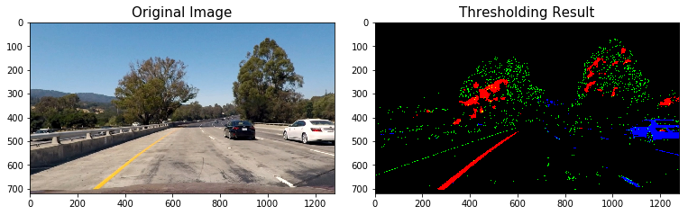
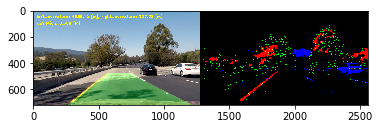

# Advanced Lane Finding Project

#### William Rifenburgh

The goals / steps of this project are the following:

* Compute the camera calibration matrix and distortion coefficients given a set of chessboard images.
* Apply a distortion correction to raw images.
* Use color transforms, gradients, etc., to create a thresholded binary image.
* Apply a perspective transform to rectify binary image ("birds-eye view").
* Detect lane pixels and fit to find the lane boundary.
* Determine the curvature of the lane and vehicle position with respect to center.
* Warp the detected lane boundaries back onto the original image.
* Output visual display of the lane boundaries and numerical estimation of lane curvature and vehicle position.

---
### Camera Calibration

The following cell calculates camera calibration parameters, undistorts the calibration images and saves them to the output_images folder. An example of an undistorted calibration image next to its original form is also plotted inline.


```python
import numpy as np
import cv2
import glob
import matplotlib.pyplot as plt
import matplotlib.image as mpimg

% matplotlib inline

# Make a list of calibration images
images = glob.glob('./camera_cal/calibration*.jpg')


# prepare object points, like (0,0,0), (1,0,0), (2,0,0) ....,(6,5,0)
objp = np.zeros((6 * 9, 3), np.float32)
objp[:, :2] = np.mgrid[0:9, 0:6].T.reshape(-1, 2)

# Arrays to store object points and image points from all the images.
objpoints = []  # 3d points in real world space
imgpoints = []  # 2d points in image plane.

# Step through the list and search for chessboard corners
for fname in images:
    img = cv2.imread(fname)
    gray = cv2.cvtColor(img, cv2.COLOR_BGR2GRAY)

    # Find the chessboard corners
    ret, corners = cv2.findChessboardCorners(gray, (9, 6), None)

    # If found, add object points, image points
    if ret == True:
        objpoints.append(objp)
        imgpoints.append(corners)

img = cv2.imread(images[0])
img_size = (img.shape[1], img.shape[0])

ret, mtx, dist, rvecs, tvecs = cv2.calibrateCamera(objpoints, imgpoints, img_size, None, None)

def undist_images(images):
    for idx, fname in enumerate(images):
        img = cv2.imread(fname)
        dst = cv2.undistort(img, mtx, dist, None, mtx)
        cv2.imwrite('./output_images/undist_' + fname.split('/')[-1], dst)

    img = cv2.imread(images[0])
    img = cv2.cvtColor(img, cv2.COLOR_RGB2BGR)
    f, (ax1, ax2) = plt.subplots(1, 2, figsize=(10, 5))
    ax1.imshow(img)
    ax1.set_title('Original Image', fontsize=15)
    ax2.imshow(cv2.undistort(img, mtx, dist, None, mtx))
    ax2.set_title('Undistorted Image', fontsize=15)


undist_images(images)
```


### Undistort test images

The following cell will undistort all test images in the test_images directory, save them to the output_images folder and compare one image's original to its undistorted form.


```python
images = glob.glob('./test_images/*.jpg')

undist_images(images)
```


### Perspective Transformation

The following cells define the functions to perform a perspective transform to road images

---

The following cell allows us to preview where our source and destination points for the prototype of our perspective transformation will go. The red line polygon and cyan line polygon indicate the source and destination regions respectively. The coordinates for the source polygon were chosen to match the lane lines. The destination polygon was chosen to represent what would be a bird's eye view of the lanes.


```python
img = cv2.imread(images[0])
img = cv2.cvtColor(img, cv2.COLOR_BGR2RGB)

img_size = (img.shape[1], img.shape[0])

src = np.float32([[200, img_size[1]], [1110, img_size[1]], [724, 475], [561, 475]])
#src = np.float32([[200, img_size[1]], [1110, img_size[1]], [770, 500], [517, 500]])

img_src_lines = cv2.polylines(img, np.int32([src]), True, (255, 0, 0), thickness=10)
plt.imshow(img_src_lines)

#dst = np.float32([[400, img_size[1]], [910, img_size[1]], [910, 0], [400, 0]])
dst = np.float32([[300, img_size[1]], [1010, img_size[1]], [1010, 0], [300, 0]])

img_dst_lines = cv2.polylines(img, np.int32([dst]), True, (0, 255, 255), thickness=10)
plt.imshow(img_dst_lines)
```


    <matplotlib.image.AxesImage at 0x10ed850f0>


The following cell defines the function that will take the source and destinations we defined along with the camera calibration to undistort and perspective transform an image. The resulting bird's eye view image of this function performed on some of the test images is then plotted.


```python
def undistort_and_transform(img, src, dst, mtx, dist):
    # Use the OpenCV undistort() function to remove distortion
    undist = cv2.undistort(img, mtx, dist, None, mtx)

    # Given src and dst points, calculate the perspective transform matrix
    M = cv2.getPerspectiveTransform(src, dst)
    
    # and the inverse as well
    Minv = cv2.getPerspectiveTransform(dst, src)
    
    # Warp the image using OpenCV warpPerspective()
    warped = cv2.warpPerspective(undist, M, img_size)

    # Return the resulting image and matrix
    return warped, M, Minv

img = cv2.imread(images[0])
img = cv2.cvtColor(img, cv2.COLOR_BGR2RGB)
warped, M, Minv = undistort_and_transform(img, src, dst, mtx, dist)
warped_dst_lines = cv2.polylines(warped, np.int32([dst]), True, (0, 255, 255), thickness=10)

img = cv2.imread(images[4])
img = cv2.cvtColor(img, cv2.COLOR_BGR2RGB)
warped, M, Minv = undistort_and_transform(img, src, dst, mtx, dist)
warped_dst_lines_curved = cv2.polylines(warped, np.int32([dst]), True, (0, 255, 255), thickness=10)

f, (ax1, ax2) = plt.subplots(1, 2, figsize=(10, 5))
ax1.imshow(warped_dst_lines)
ax1.set_title('Straight and Centered Lane Image', fontsize=15)
ax2.imshow(warped_dst_lines_curved)
ax2.set_title('Curved Lane Image', fontsize=15)
```


    <matplotlib.text.Text at 0x11f422208>


### Color and Gradient Thresholding

The following cell contains code for the function used to identify lane markings using thresholding of sobel x operator convolutions as well as HLS and LAB colorspace transforms. A result of thresholding is shown where the green indicates where HLS-L channel x-gradient thresholding criteria were met, blue indicates where HSL-L color lightness thresholding criteria was met, and red indicates where LAB-B channel thresholding criteria was met. High LAB-B channel values indicate where yellow lane markings are detected whilst the other two filters identify white lane markings


```python
image = mpimg.imread('./output_images/undist_test1.jpg')

# Edit this function to create your own pipeline.
def threshold_image(img, s_thresh=(210, 255), sx_thresh=(30, 45), b_thresh=(150, 255)):
    img = np.copy(img)

    # Convert to HSL color space and separate the L channel
    hls = cv2.cvtColor(img, cv2.COLOR_RGB2HLS).astype(np.float)
    l_channel = hls[:, :, 1]
    s_channel = hls[:, :, 2]

    # Convert to HSL color space and separate the L channel
    lab = cv2.cvtColor(img, cv2.COLOR_RGB2LAB).astype(np.float)
    lab_b_channel = lab[:, :, 2]

    # Sobel x
    sobelx = cv2.Sobel(l_channel, cv2.CV_64F, 1, 0)  # Take the derivative in x
    abs_sobelx = np.absolute(sobelx)  # Absolute x derivative to accentuate lines away from horizontal
    scaled_sobel = np.uint8(255 * abs_sobelx / np.max(abs_sobelx))

    # Threshold x gradient
    sxbinary = np.zeros_like(scaled_sobel)
    sxbinary[(scaled_sobel >= sx_thresh[0]) & (scaled_sobel <= sx_thresh[1])] = 1

    # Threshold color channel S of HLS
    s_binary = np.zeros_like(l_channel)
    s_binary[(l_channel >= s_thresh[0]) & (l_channel <= s_thresh[1])] = 1

    # Threshold color channel B of LAB
    b_binary = np.zeros_like(lab_b_channel)
    b_binary[(lab_b_channel >= b_thresh[0]) & (lab_b_channel <= b_thresh[1])] = 1

    # Stack each channel
    # Note color_binary[:, :, 0] is all 0s, effectively an all black image. It might
    # be beneficial to replace this channel with something else.
    color_binary = np.dstack((b_binary, sxbinary, s_binary))

    combined_binary = np.zeros_like(sxbinary)
    combined_binary[(s_binary == 1) | (sxbinary == 1) | (b_binary == 1)] = 1

    return color_binary, combined_binary

result, result_binary = threshold_image(image)

# Plot the result
f, (ax1, ax2) = plt.subplots(1, 2, figsize=(10, 5))
f.tight_layout()

ax1.imshow(image)
ax1.set_title('Original Image', fontsize=15)

ax2.imshow(result)
ax2.set_title('Thresholding Result', fontsize=15)
plt.subplots_adjust(left=0., right=1, top=0.9, bottom=0.)

result = 255 * result.astype("uint8")
result = cv2.cvtColor(result, cv2.COLOR_RGB2BGR)
cv2.imwrite("output_images/colored_binary.jpg", result)

binary = 255 * result_binary.astype("uint8")
cv2.imwrite("./output_images/combined_binary.jpg", binary)
```


    True





### Lane Line Polynomial Fitting

Below is an example of thresholding and perspective transforming a road image using the functions we have previously developed


```python
image = mpimg.imread('./test_images/test2.jpg')
result, result_binary = threshold_image(image)
warped, M, Minv = undistort_and_transform(result_binary, src, dst, mtx, dist)
# Plot the result
f, (ax1, ax2) = plt.subplots(1, 2, figsize=(10, 5))
f.tight_layout()

ax1.imshow(image)
ax1.set_title('Original Image', fontsize=15)

ax2.imshow(warped, cmap='gray')
ax2.set_title('Threshold-Transform Result', fontsize=15)
plt.subplots_adjust(left=0., right=1, top=0.9, bottom=0.)
```


The code cell below will plot a histogram of the bottom half of the binary, perspective transformed image. The  peaks indicate the x-position of both lane lines and where the find_polynomails function will begin its search for the lane lines.


```python
#Plot histogram of threshold-transform binary image
histogram = np.sum(warped[warped.shape[0]//2:,:], axis=0)
plt.plot(histogram)
```


    [<matplotlib.lines.Line2D at 0x11ffde390>]


The following cell defines the lane finding function which takes in a warped, binary image and fits polynomials to each lane marking side. The functions plotgraph option enables us to preview these lane line polynomials. The function find_curvature_and_offset is also defined beforehand so that it may be used in find_polynomials as much of its required arguments are caculated in the find_polynomials function.


```python
# Define conversions in x and y from pixels space to meters
ym_per_pix = 30 / 720  # meters per pixel in y dimension
xm_per_pix = 3.7 / 500  # meters per pixel in x dimension

def find_curvature_and_offset(leftx, rightx, lefty, righty, img_height_pix, img_width_pix):
    # Fit new polynomials to x,y in world space
    left_fit_cr = np.polyfit(lefty * ym_per_pix, leftx * xm_per_pix, 2)
    right_fit_cr = np.polyfit(righty * ym_per_pix, rightx * xm_per_pix, 2)
    # Calculate the new radii of curvature at the base of the image (img_height_pix)
    left_curverad = np.sign(left_fit_cr[0]) * (
    ((1 + (2 * left_fit_cr[0] * img_height_pix * ym_per_pix + left_fit_cr[1]) ** 2) ** 1.5) / np.absolute(
        2 * left_fit_cr[0]))
    right_curverad = np.sign(right_fit_cr[0]) * (((1 + (
        2 * right_fit_cr[0] * img_height_pix * ym_per_pix + right_fit_cr[1]) ** 2) ** 1.5) / np.absolute(
        2 * right_fit_cr[0]))

    img_height_m = img_height_pix * ym_per_pix
    img_width_m = img_width_pix * xm_per_pix

    left_intercept = np.polyval(left_fit_cr, img_height_m)
    right_intercept = np.polyval(right_fit_cr, img_width_m)

    center = (left_intercept + right_intercept) / 2.0

    offset_m = center - img_width_m / 2.0

    return left_curverad, right_curverad, offset_m

def find_polynomials(binary_warped, plotgraph=False):
    # Assuming you have created a warped binary image called "binary_warped"
    # Take a histogram of the bottom half of the image
    histogram = np.sum(binary_warped[binary_warped.shape[0] // 2:, :], axis=0)
    # Create an output image to draw on and  visualize the result
    out_img = np.dstack((binary_warped, binary_warped, binary_warped)) * 255
    # Find the peak of the left and right halves of the histogram
    # These will be the starting point for the left and right lines
    midpoint = np.int(histogram.shape[0] / 2)
    leftx_base = np.argmax(histogram[:midpoint])
    rightx_base = np.argmax(histogram[midpoint:]) + midpoint

    # Choose the number of sliding windows
    nwindows = 8
    # Set height of windows
    window_height = np.int(binary_warped.shape[0] / nwindows)
    # Identify the x and y positions of all nonzero pixels in the image
    nonzero = binary_warped.nonzero()
    nonzeroy = np.array(nonzero[0])
    nonzerox = np.array(nonzero[1])
    # Current positions to be updated for each window
    leftx_current = leftx_base
    rightx_current = rightx_base
    # Set the width of the windows +/- margin
    margin = 100
    # Set minimum number of pixels found to recenter window
    minpix = 50
    # Create empty lists to receive left and right lane pixel indices
    left_lane_inds = []
    right_lane_inds = []

    # Step through the windows one by one
    for window in range(nwindows):
        # Identify window boundaries in x and y (and right and left)
        win_y_low = binary_warped.shape[0] - (window + 1) * window_height
        win_y_high = binary_warped.shape[0] - window * window_height
        win_xleft_low = leftx_current - margin
        win_xleft_high = leftx_current + margin
        win_xright_low = rightx_current - margin
        win_xright_high = rightx_current + margin
        # Draw the windows on the visualization image
        cv2.rectangle(out_img, (win_xleft_low, win_y_low), (win_xleft_high, win_y_high), (0, 255, 0), 2)
        cv2.rectangle(out_img, (win_xright_low, win_y_low), (win_xright_high, win_y_high), (0, 255, 0), 2)
        # Identify the nonzero pixels in x and y within the window
        good_left_inds = ((nonzeroy >= win_y_low) & (nonzeroy < win_y_high) & (nonzerox >= win_xleft_low) & (
            nonzerox < win_xleft_high)).nonzero()[0]
        good_right_inds = ((nonzeroy >= win_y_low) & (nonzeroy < win_y_high) & (nonzerox >= win_xright_low) & (
            nonzerox < win_xright_high)).nonzero()[0]
        # Append these indices to the lists
        left_lane_inds.append(good_left_inds)
        right_lane_inds.append(good_right_inds)
        # If you found > minpix pixels, recenter next window on their mean position
        if len(good_left_inds) > minpix:
            leftx_current = np.int(np.mean(nonzerox[good_left_inds]))
        if len(good_right_inds) > minpix:
            rightx_current = np.int(np.mean(nonzerox[good_right_inds]))

    # Concatenate the arrays of indices
    left_lane_inds = np.concatenate(left_lane_inds)
    right_lane_inds = np.concatenate(right_lane_inds)

    # Extract left and right line pixel positions
    leftx = nonzerox[left_lane_inds]
    lefty = nonzeroy[left_lane_inds]
    rightx = nonzerox[right_lane_inds]
    righty = nonzeroy[right_lane_inds]

    # Fit a second order polynomial to each
    left_fit = np.polyfit(lefty, leftx, 2)
    right_fit = np.polyfit(righty, rightx, 2)

    # Generate x and y values for plotting
    ploty = np.linspace(0, binary_warped.shape[0] - 1, binary_warped.shape[0])
    left_fitx = left_fit[0] * ploty ** 2 + left_fit[1] * ploty + left_fit[2]
    right_fitx = right_fit[0] * ploty ** 2 + right_fit[1] * ploty + right_fit[2]

    nonzero = binary_warped.nonzero()
    nonzeroy = np.array(nonzero[0])
    nonzerox = np.array(nonzero[1])

    out_img[nonzeroy[left_lane_inds], nonzerox[left_lane_inds]] = [255, 0, 0]
    out_img[nonzeroy[right_lane_inds], nonzerox[right_lane_inds]] = [0, 0, 255]

    if plotgraph:
        plt.figure(figsize=(16, 8))
        plt.imshow(out_img)
        plt.plot(left_fitx, ploty, color='yellow')
        plt.plot(right_fitx, ploty, color='yellow')
        plt.xlim(0, 1280)
        plt.ylim(720, 0)

    l_curverad, r_curverad, offset_m = find_curvature_and_offset(leftx, rightx, lefty, righty, binary_warped.shape[0],
                                                                 binary_warped.shape[1])

    return left_fit, right_fit, l_curverad, r_curverad, offset_m, out_img


left_fit, right_fit, left_curverad, right_curverad, vehicle_offset_m, out_img = find_polynomials(warped, True)

print('left_curverad: ', left_curverad, ' [m], right_curverad: ', right_curverad, ' [m], offset_m: ', vehicle_offset_m,
      ' [m]')
```

    left_curverad:  -1103.92437348  [m], right_curverad:  -488.921299024  [m], offset_m:  0.522545175413  [m]


To help keep track of lane lines in sharp curves and challenging conditions as well as skip the windowing operations, we can use the polynomials found from the initial find_polynomials function to narrow our search to a region of interest around the previous polynomials for the next frame in a video. The next cell defines the function for this method. A plot showing the region of interest may be shown by setting plotgraph=True.


```python
def find_polynomials_skip_windowing(binary_warped, left_fit, right_fit, plotgraph=False):
    # Assume you now have a new warped binary image 
    # from the next frame of video (also called "binary_warped")
    # It's now much easier to find line pixels!
    nonzero = binary_warped.nonzero()
    nonzeroy = np.array(nonzero[0])
    nonzerox = np.array(nonzero[1])
    margin = 100
    left_lane_inds = ((nonzerox > (left_fit[0] * (nonzeroy ** 2) + left_fit[1] * nonzeroy + left_fit[2] - margin)) & (
    nonzerox < (left_fit[0] * (nonzeroy ** 2) + left_fit[1] * nonzeroy + left_fit[2] + margin)))
    right_lane_inds = (
    (nonzerox > (right_fit[0] * (nonzeroy ** 2) + right_fit[1] * nonzeroy + right_fit[2] - margin)) & (
    nonzerox < (right_fit[0] * (nonzeroy ** 2) + right_fit[1] * nonzeroy + right_fit[2] + margin)))

    # Again, extract left and right line pixel positions
    leftx = nonzerox[left_lane_inds]
    lefty = nonzeroy[left_lane_inds]
    rightx = nonzerox[right_lane_inds]
    righty = nonzeroy[right_lane_inds]
    # Fit a second order polynomial to each
    left_fit = np.polyfit(lefty, leftx, 2)
    right_fit = np.polyfit(righty, rightx, 2)
    # Generate x and y values for plotting
    ploty = np.linspace(0, binary_warped.shape[0] - 1, binary_warped.shape[0])
    left_fitx = left_fit[0] * ploty ** 2 + left_fit[1] * ploty + left_fit[2]
    right_fitx = right_fit[0] * ploty ** 2 + right_fit[1] * ploty + right_fit[2]

    # Create an image to draw on and an image to show the selection window
    out_img = np.dstack((binary_warped, binary_warped, binary_warped)) * 255
    window_img = np.zeros_like(out_img)
    # Color in left and right line pixels
    out_img[nonzeroy[left_lane_inds], nonzerox[left_lane_inds]] = [255, 0, 0]
    out_img[nonzeroy[right_lane_inds], nonzerox[right_lane_inds]] = [0, 0, 255]

    result = np.zeros_like(out_img)
    
    if plotgraph:
        # Generate a polygon to illustrate the search window area
        # And recast the x and y points into usable format for cv2.fillPoly()
        left_line_window1 = np.array([np.transpose(np.vstack([left_fitx - margin, ploty]))])
        left_line_window2 = np.array([np.flipud(np.transpose(np.vstack([left_fitx + margin, ploty])))])
        left_line_pts = np.hstack((left_line_window1, left_line_window2))
        right_line_window1 = np.array([np.transpose(np.vstack([right_fitx - margin, ploty]))])
        right_line_window2 = np.array([np.flipud(np.transpose(np.vstack([right_fitx + margin, ploty])))])
        right_line_pts = np.hstack((right_line_window1, right_line_window2))

        # Draw the lane onto the warped blank image
        cv2.fillPoly(window_img, np.int_([left_line_pts]), (0, 255, 0))
        cv2.fillPoly(window_img, np.int_([right_line_pts]), (0, 255, 0))
        result = cv2.addWeighted(out_img, 1, window_img, 0.3, 0)
        plt.figure(figsize=(16, 8))
        plt.imshow(result)
        plt.plot(left_fitx, ploty, color='yellow')
        plt.plot(right_fitx, ploty, color='yellow')
        plt.xlim(0, 1280)
        plt.ylim(720, 0)

    l_curverad, r_curverad, offset_m = find_curvature_and_offset(leftx, rightx, lefty, righty, binary_warped.shape[0],
                                                                 binary_warped.shape[1])

    return left_fit, right_fit, l_curverad, r_curverad, offset_m, result

left_fit, right_fit, left_curverad, right_curverad, vehicle_offset_m, result = find_polynomials_skip_windowing(warped, left_fit,
                                                                                                       right_fit, True)

print('left_curverad: ',left_curverad, ' [m], right_curverad: ' , right_curverad, ' [m], offset_m: ' , vehicle_offset_m, ' [m]')
```

    left_curverad:  -1105.90694057  [m], right_curverad:  -488.921299024  [m], offset_m:  0.522579257882  [m]


The following function draws the green overlay of what our algorithms perceive to be the lane as well as radius of curvature for the lanes and deviation off the center of the lane.


```python
def draw_lane(undistorted_img, warped, left_fit, right_fit, minv, l_radius, r_radius, deviation_offset, error_vec):
    ploty = np.linspace(0, warped.shape[0] - 1, warped.shape[0])
    left_fitx = np.polyval(left_fit, ploty)
    right_fitx = np.polyval(right_fit, ploty)

    # Create an image to draw the lines on
    warp_zero = np.zeros_like(warped).astype(np.uint8)
    color_warp = np.dstack((warp_zero, warp_zero, warp_zero))

    # Recast the x and y points into usable format for cv2.fillPoly()
    pts_left = np.array([np.transpose(np.vstack([left_fitx, ploty]))])
    pts_right = np.array([np.flipud(np.transpose(np.vstack([right_fitx, ploty])))])
    pts = np.hstack((pts_left, pts_right))

    # Draw the lane onto the warped blank image
    cv2.fillPoly(color_warp, np.int_([pts]), (0, 255, 0))

    # Warp the blank back to original image space using inverse perspective matrix (Minv)
    newwarp = cv2.warpPerspective(color_warp, minv, (undistorted_img.shape[1], undistorted_img.shape[0]))
    # Combine the result with the original image
    result = cv2.addWeighted(undistorted_img, 1, newwarp, 0.3, 0)

    # Add Curvature and Deviation Text
    l_radius_txt = str(np.round(l_radius, 2))
    r_radius_txt = str(np.round(r_radius, 2))
    deviation_offset_txt = "{:.3f}".format(deviation_offset)
    font = cv2.FONT_HERSHEY_PLAIN
    curvature_txt = "left_curvature: " + l_radius_txt + " [m], right_curvature: " + r_radius_txt + " [m]"
    deviation_txt = "deviation: " + deviation_offset_txt + " [m]"
    curvature_err_txt = "Lane curvatures differ"
    lane_width_err_txt = "Bad lane width"
    parallelism_err_txt = "Lanes not Parallel"

    cv2.putText(result, curvature_txt, (30, 60), font, 2, (255, 255, 0), 3)
    cv2.putText(result, deviation_txt, (30, 110), font, 2, (255, 255, 0), 3)
    if(error_vec[0]==1):
        cv2.putText(result, curvature_err_txt, (30, 160), font, 2, (255, 0, 0), 3)
    if(error_vec[1]==1):
        cv2.putText(result, lane_width_err_txt, (30, 210), font, 2, (255, 0, 0), 3)
    if(error_vec[2]==1):
        cv2.putText(result, parallelism_err_txt, (30, 260), font, 2, (255, 0, 0), 3)


    return result

image = mpimg.imread('./test_images/test2.jpg')
undist = cv2.undistort(image, mtx, dist, None, mtx)
error_vec = [1, 1, 1]
result = draw_lane(undist, warped, left_fit, right_fit, Minv, left_curverad, right_curverad, vehicle_offset_m, error_vec)

plt.imshow(result)
```


    <matplotlib.image.AxesImage at 0x11a973d68>


The following cell defines the sanity_check function. This function checks the following:

If both lanes lines in a given a lane detection output have:

* Similar curvature
* A reasonable lane width
* Are parallel to each other within a given tolerance

Curvature was checked by calculating the magnitude of difference of curvatures calcalated between the lane lines

The largests and smallest distances between the two lane lines was calculated and expected to fall within a min-max range.

Parallelism was checked by taking the derivative of both lanes and calculating the greatest difference for the derivative for all given y-values that we care to draw the lane on.

The curvature criterion was later excluded as it was found to disqualify lane detections too easily when the road became too staight.


```python
# Sanity check to perform on the current detected lane lines
def sanity_check(warped, left_fit, right_fit, left_curverad, right_curverad):
    maxAllowablePolynomialDerivativeDifference = 1.0
    maxAllowableCurvatureDifference = 1500
    maxAllowableLaneWidthMeters = 5.7
    minAllowableWidthMeters = 2.7

    errorVector = [0, 0, 0]

    # Generate x and y values for plotting
    ploty = np.linspace(0, warped.shape[0] - 1, warped.shape[0])

    # Check if lines have similar curvature
    if np.absolute(left_curverad - right_curverad) > maxAllowableCurvatureDifference:
        errorVector[0] = 0

    # Check that they are separated by approximately the right distance horizontally
    left_fitx = np.polyval(left_fit, ploty)
    right_fitx = np.polyval(right_fit, ploty)
    maxWidthPerceived = np.amax(xm_per_pix * np.abs(right_fitx - left_fitx))
    minWidthPerceived = np.amin(xm_per_pix * np.abs(right_fitx - left_fitx))
    if (maxWidthPerceived > maxAllowableLaneWidthMeters) | (minWidthPerceived < minAllowableWidthMeters):
        errorVector[1] = 1

    # Checking that they are roughly parallel
    left_derivative = left_fit[0] * ploty * 2 + left_fit[1]
    right_derivative = right_fit[0] * ploty * 2 + right_fit[1]
    maxPolynomialDerivativeDifference = np.amax(np.absolute(left_derivative - right_derivative))
    if maxAllowablePolynomialDerivativeDifference < maxPolynomialDerivativeDifference:
        errorVector[2] = 1

    return errorVector
```

The following cell defines the process_image function used in creating the video lane overlays and the code required to remember lane detections for the averaging filter used to smoothen the lane overlay. The class 'Lane' stores lane detection parameters. add_lane_to_history is a helper function that assigns values to the Lane class' parameters. concat_images allows us to display the color and gradient transformation data image next to our output video which is usefull for debugging and fine tunning our threshold values.


```python
class Lane():
    pass
    def __init__(self):
        self.left_fit = None
        self.right_fit = None
        self.left_curvature = None
        self.right_curvature = None
        self.vehicle_offset_m = None
        self.lane_frame_age = 0

def add_lane_to_history(history, left_fit, right_fit, left_curverad, right_curverad, vehicle_offset_m):
    new_lane = Lane()
    new_lane.left_fit = left_fit
    new_lane.right_fit = right_fit
    new_lane.left_curvature = left_curverad
    new_lane.right_curvature = right_curverad
    new_lane.vehicle_offset_m = vehicle_offset_m
    history.insert(0, new_lane)
    return new_lane

lanes_history = []

from PIL import Image

def concat_images(imga, imgb):
    ha, wa = imga.shape[:2]
    hb, wb = imgb.shape[:2]
    max_height = np.max([ha, hb])
    total_width = wa + wb
    image_a = Image.fromarray(imga, 'RGB')
    image_b = Image.fromarray(imgb, 'RGB')
    new_img = Image.new('RGB', (total_width, max_height))
    new_img.paste(image_a, (0, 0))
    new_img.paste(image_b, (wa, 0))
    output = np.array(new_img)
    return output

def process_image(image):
    # Binarize and warp image
    result_colored, result_binary = threshold_image(image)
    warped, M, Minv = undistort_and_transform(result_binary, src, dst, mtx, dist)
    n = 14

    # Fit polynomial
    if len(lanes_history) == 0:
        left_fit, right_fit, left_curverad, right_curverad, vehicle_offset_m, debug_img = find_polynomials(warped,
                                                                                                           False)
        error = sanity_check(warped, left_fit, right_fit, left_curverad, right_curverad)
        if error == [0, 0, 0]:
            add_lane_to_history(lanes_history, left_fit, right_fit, left_curverad, right_curverad, vehicle_offset_m)
    else:
        most_recent_lane = lanes_history[0]
        left_fit, right_fit, left_curverad, right_curverad, vehicle_offset_m, debug_img = find_polynomials_skip_windowing(
            warped, most_recent_lane.left_fit, most_recent_lane.right_fit, False)
        error = sanity_check(warped, left_fit, right_fit, left_curverad, right_curverad)
        if error == [0, 0, 0]:
            add_lane_to_history(lanes_history, left_fit, right_fit, left_curverad, right_curverad, vehicle_offset_m)

        left_fits = []
        right_fits = []
        for lane in lanes_history:
            left_fits.insert(0, lane.left_fit)
            right_fits.insert(0, lane.right_fit)

        left_fit = np.array(left_fits).mean(0)
        right_fit = np.array(right_fits).mean(0)

        if len(lanes_history) > n:
            lanes_history.pop()

        for i, lane in enumerate(lanes_history):
            lane.lane_frame_age += 1
            if lane.lane_frame_age > 2 * n:
                lanes_history.pop(i)

    undist = cv2.undistort(image, mtx, dist, None, mtx)
    result = draw_lane(undist, warped, left_fit, right_fit, Minv, left_curverad, right_curverad, vehicle_offset_m,
                       error)

    #out_img = np.dstack((warped, warped, warped)) * 255
    result_colored = 255 * result_colored.astype("uint8")
    result = concat_images(result, result_colored)
    return result

image = mpimg.imread('./test_images/test4.jpg')
result = process_image(image)

plt.imshow(result)

#result = 255 * result.astype("uint8")
```


    <matplotlib.image.AxesImage at 0x10e681898>





### Videos

The following four cells use the process image function to create videos overlayed with our lane finding algorithm results. The videos are available here:

[project_video](./output_images/project_video_output.mp4)

[project_video_challenge](./output_images/project_video_challenge_output.mp4)

[project_video_harder_challenge](./output_images/project_video_harder_challenge_output.mp4)


```python
from moviepy.editor import VideoFileClip
from IPython.display import HTML
```


```python
video_output = "./output_images/project_video_output.mp4"
clip1 = VideoFileClip("./project_video.mp4")
clip1_output = clip1.fl_image(process_image) #NOTE: this function expects color images!!
%time clip1_output.write_videofile(video_output, audio=False)
```

    [MoviePy] >>>> Building video ./output_images/project_video_output.mp4
    [MoviePy] Writing video ./output_images/project_video_output.mp4


    100%|█████████▉| 1260/1261 [03:59<00:00,  5.38it/s]


    [MoviePy] Done.
    [MoviePy] >>>> Video ready: ./output_images/project_video_output.mp4 
    
    CPU times: user 4min 26s, sys: 58.3 s, total: 5min 24s
    Wall time: 4min


```python
video_challenge_output = "output_images/project_video_challenge_output.mp4"
clip1 = VideoFileClip("challenge_video.mp4")
clip1_output = clip1.fl_image(process_image) #NOTE: this function expects color images!!
%time clip1_output.write_videofile(video_challenge_output, audio=False)
```

    [MoviePy] >>>> Building video output_images/project_video_challenge_output.mp4
    [MoviePy] Writing video output_images/project_video_challenge_output.mp4


    100%|██████████| 485/485 [01:27<00:00,  5.30it/s]


    [MoviePy] Done.
    [MoviePy] >>>> Video ready: output_images/project_video_challenge_output.mp4 
    
    CPU times: user 1min 39s, sys: 20.7 s, total: 2min
    Wall time: 1min 28s


```python
video_harder_challenge_output = "output_images/project_video_harder_challenge_output.mp4"
clip1 = VideoFileClip("harder_challenge_video.mp4")
clip1_output = clip1.fl_image(process_image) #NOTE: this function expects color images!!
%time clip1_output.write_videofile(video_harder_challenge_output, audio=False)
```

    [MoviePy] >>>> Building video output_images/project_video_harder_challenge_output.mp4
    [MoviePy] Writing video output_images/project_video_harder_challenge_output.mp4


    
      0%|          | 0/1200 [00:00<?, ?it/s]
      0%|          | 1/1200 [00:00<04:12,  4.74it/s]
      0%|          | 2/1200 [00:00<04:11,  4.76it/s]
      0%|          | 3/1200 [00:00<04:07,  4.83it/s]
      0%|          | 4/1200 [00:00<04:05,  4.87it/s]
      0%|          | 5/1200 [00:01<04:02,  4.94it/s]
      0%|          | 6/1200 [00:01<04:04,  4.88it/s]
      1%|          | 7/1200 [00:01<04:02,  4.91it/s]
      1%|          | 8/1200 [00:01<04:05,  4.86it/s]
      1%|          | 9/1200 [00:01<04:01,  4.94it/s]
      1%|          | 10/1200 [00:02<04:02,  4.91it/s]
      1%|          | 11/1200 [00:02<04:00,  4.95it/s]
      1%|          | 12/1200 [00:02<04:00,  4.95it/s]
      1%|          | 13/1200 [00:02<04:00,  4.94it/s]
      1%|          | 14/1200 [00:02<03:58,  4.98it/s]
      1%|▏         | 15/1200 [00:03<03:56,  5.01it/s]
      1%|▏         | 16/1200 [00:03<03:58,  4.97it/s]
      1%|▏         | 17/1200 [00:03<03:57,  4.97it/s]
      2%|▏         | 18/1200 [00:03<04:00,  4.91it/s]
      2%|▏         | 19/1200 [00:03<04:00,  4.92it/s]
      2%|▏         | 20/1200 [00:04<04:01,  4.88it/s]
      2%|▏         | 21/1200 [00:04<04:00,  4.90it/s]
      2%|▏         | 22/1200 [00:04<03:59,  4.91it/s]
      2%|▏         | 23/1200 [00:04<04:01,  4.88it/s]
      2%|▏         | 24/1200 [00:04<04:04,  4.80it/s]
      2%|▏         | 25/1200 [00:05<04:10,  4.69it/s]
      2%|▏         | 26/1200 [00:05<04:12,  4.65it/s]
      2%|▏         | 27/1200 [00:05<04:10,  4.69it/s]
      2%|▏         | 28/1200 [00:05<04:09,  4.69it/s]
      2%|▏         | 29/1200 [00:05<04:04,  4.79it/s]
      2%|▎         | 30/1200 [00:06<04:04,  4.79it/s]
      3%|▎         | 31/1200 [00:06<04:02,  4.82it/s]
      3%|▎         | 32/1200 [00:06<04:02,  4.81it/s]
      3%|▎         | 33/1200 [00:06<04:04,  4.78it/s]
      3%|▎         | 34/1200 [00:06<04:01,  4.83it/s]
      3%|▎         | 35/1200 [00:07<03:57,  4.90it/s]
      3%|▎         | 36/1200 [00:07<03:56,  4.92it/s]
      3%|▎         | 37/1200 [00:07<03:55,  4.95it/s]
      3%|▎         | 38/1200 [00:07<03:53,  4.98it/s]
      3%|▎         | 39/1200 [00:07<03:55,  4.94it/s]
      3%|▎         | 40/1200 [00:08<03:53,  4.97it/s]
      3%|▎         | 41/1200 [00:08<03:57,  4.87it/s]
      4%|▎         | 42/1200 [00:08<03:57,  4.88it/s]
      4%|▎         | 43/1200 [00:08<03:58,  4.85it/s]
      4%|▎         | 44/1200 [00:09<03:56,  4.88it/s]
      4%|▍         | 45/1200 [00:09<03:56,  4.89it/s]
      4%|▍         | 46/1200 [00:09<03:57,  4.85it/s]
      4%|▍         | 47/1200 [00:09<03:55,  4.89it/s]
      4%|▍         | 48/1200 [00:09<03:55,  4.89it/s]
      4%|▍         | 49/1200 [00:10<03:56,  4.87it/s]
      4%|▍         | 50/1200 [00:10<03:56,  4.85it/s]
      4%|▍         | 51/1200 [00:10<03:55,  4.88it/s]
      4%|▍         | 52/1200 [00:10<03:55,  4.87it/s]
      4%|▍         | 53/1200 [00:10<03:53,  4.91it/s]
      4%|▍         | 54/1200 [00:11<03:52,  4.93it/s]
      5%|▍         | 55/1200 [00:11<03:50,  4.97it/s]
      5%|▍         | 56/1200 [00:11<03:49,  5.00it/s]
      5%|▍         | 57/1200 [00:11<03:47,  5.01it/s]
      5%|▍         | 58/1200 [00:11<03:46,  5.04it/s]
      5%|▍         | 59/1200 [00:12<03:45,  5.06it/s]
      5%|▌         | 60/1200 [00:12<03:44,  5.07it/s]
      5%|▌         | 61/1200 [00:12<03:43,  5.10it/s]
      5%|▌         | 62/1200 [00:12<03:41,  5.15it/s]
      5%|▌         | 63/1200 [00:12<03:39,  5.17it/s]
      5%|▌         | 64/1200 [00:13<03:36,  5.26it/s]
      5%|▌         | 65/1200 [00:13<03:36,  5.25it/s]
      6%|▌         | 66/1200 [00:13<03:33,  5.31it/s]
      6%|▌         | 67/1200 [00:13<03:33,  5.30it/s]
      6%|▌         | 68/1200 [00:13<03:32,  5.32it/s]
      6%|▌         | 69/1200 [00:13<03:32,  5.33it/s]
      6%|▌         | 70/1200 [00:14<03:35,  5.25it/s]
      6%|▌         | 71/1200 [00:14<03:34,  5.27it/s]
      6%|▌         | 72/1200 [00:14<03:33,  5.28it/s]
      6%|▌         | 73/1200 [00:14<03:35,  5.22it/s]
      6%|▌         | 74/1200 [00:14<03:35,  5.22it/s]
      6%|▋         | 75/1200 [00:15<03:34,  5.24it/s]
      6%|▋         | 76/1200 [00:15<03:33,  5.26it/s]
      6%|▋         | 77/1200 [00:15<03:32,  5.29it/s]
      6%|▋         | 78/1200 [00:15<03:33,  5.26it/s]
      7%|▋         | 79/1200 [00:15<03:34,  5.22it/s]
      7%|▋         | 80/1200 [00:16<03:36,  5.18it/s]
      7%|▋         | 81/1200 [00:16<03:34,  5.22it/s]
      7%|▋         | 82/1200 [00:16<03:33,  5.24it/s]
      7%|▋         | 83/1200 [00:16<03:32,  5.26it/s]
      7%|▋         | 84/1200 [00:16<03:33,  5.22it/s]
      7%|▋         | 85/1200 [00:17<03:33,  5.22it/s]
      7%|▋         | 86/1200 [00:17<03:31,  5.26it/s]
      7%|▋         | 87/1200 [00:17<03:32,  5.24it/s]
      7%|▋         | 88/1200 [00:17<03:32,  5.23it/s]
      7%|▋         | 89/1200 [00:17<03:30,  5.28it/s]
      8%|▊         | 90/1200 [00:17<03:31,  5.25it/s]
      8%|▊         | 91/1200 [00:18<03:29,  5.30it/s]
      8%|▊         | 92/1200 [00:18<03:28,  5.32it/s]
      8%|▊         | 93/1200 [00:18<03:28,  5.30it/s]
      8%|▊         | 94/1200 [00:18<03:28,  5.30it/s]
      8%|▊         | 95/1200 [00:18<03:28,  5.29it/s]
      8%|▊         | 96/1200 [00:19<03:31,  5.22it/s]
      8%|▊         | 97/1200 [00:19<03:31,  5.21it/s]
      8%|▊         | 98/1200 [00:19<03:31,  5.21it/s]
      8%|▊         | 99/1200 [00:19<03:33,  5.17it/s]
      8%|▊         | 100/1200 [00:19<03:31,  5.19it/s]
      8%|▊         | 101/1200 [00:20<03:31,  5.19it/s]
      8%|▊         | 102/1200 [00:20<03:31,  5.20it/s]
      9%|▊         | 103/1200 [00:20<03:37,  5.05it/s]
      9%|▊         | 104/1200 [00:20<03:35,  5.08it/s]
      9%|▉         | 105/1200 [00:20<03:37,  5.04it/s]
      9%|▉         | 106/1200 [00:21<03:35,  5.07it/s]
      9%|▉         | 107/1200 [00:21<03:34,  5.10it/s]
      9%|▉         | 108/1200 [00:21<03:34,  5.08it/s]
      9%|▉         | 109/1200 [00:21<03:34,  5.09it/s]
      9%|▉         | 110/1200 [00:21<03:33,  5.10it/s]
      9%|▉         | 111/1200 [00:22<03:32,  5.11it/s]
      9%|▉         | 112/1200 [00:22<03:32,  5.13it/s]
      9%|▉         | 113/1200 [00:22<03:34,  5.07it/s]
     10%|▉         | 114/1200 [00:22<03:34,  5.06it/s]
     10%|▉         | 115/1200 [00:22<03:34,  5.05it/s]
     10%|▉         | 116/1200 [00:23<03:37,  4.99it/s]
     10%|▉         | 117/1200 [00:23<03:38,  4.97it/s]
     10%|▉         | 118/1200 [00:23<03:37,  4.98it/s]
     10%|▉         | 119/1200 [00:23<03:38,  4.95it/s]
     10%|█         | 120/1200 [00:23<03:37,  4.96it/s]
     10%|█         | 121/1200 [00:24<03:37,  4.95it/s]
     10%|█         | 122/1200 [00:24<03:37,  4.95it/s]
     10%|█         | 123/1200 [00:24<03:37,  4.96it/s]
     10%|█         | 124/1200 [00:24<03:37,  4.95it/s]
     10%|█         | 125/1200 [00:24<03:37,  4.95it/s]
     10%|█         | 126/1200 [00:25<03:35,  4.98it/s]
     11%|█         | 127/1200 [00:25<03:35,  4.97it/s]
     11%|█         | 128/1200 [00:25<03:36,  4.96it/s]
     11%|█         | 129/1200 [00:25<03:37,  4.94it/s]
     11%|█         | 130/1200 [00:25<03:35,  4.96it/s]
     11%|█         | 131/1200 [00:26<03:35,  4.96it/s]
     11%|█         | 132/1200 [00:26<03:34,  4.98it/s]
     11%|█         | 133/1200 [00:26<03:34,  4.98it/s]
     11%|█         | 134/1200 [00:26<03:35,  4.96it/s]
     11%|█▏        | 135/1200 [00:26<03:33,  4.98it/s]
     11%|█▏        | 136/1200 [00:27<03:32,  5.00it/s]
     11%|█▏        | 137/1200 [00:27<03:30,  5.04it/s]
     12%|█▏        | 138/1200 [00:27<03:31,  5.03it/s]
     12%|█▏        | 139/1200 [00:27<03:32,  5.00it/s]
     12%|█▏        | 140/1200 [00:27<03:31,  5.02it/s]
     12%|█▏        | 141/1200 [00:28<03:31,  5.01it/s]
     12%|█▏        | 142/1200 [00:28<03:31,  5.01it/s]
     12%|█▏        | 143/1200 [00:28<03:27,  5.09it/s]
     12%|█▏        | 144/1200 [00:28<03:27,  5.09it/s]
     12%|█▏        | 145/1200 [00:28<03:24,  5.15it/s]
     12%|█▏        | 146/1200 [00:29<03:24,  5.17it/s]
     12%|█▏        | 147/1200 [00:29<03:25,  5.12it/s]
     12%|█▏        | 148/1200 [00:29<03:24,  5.15it/s]
     12%|█▏        | 149/1200 [00:29<03:24,  5.13it/s]
     12%|█▎        | 150/1200 [00:29<03:27,  5.06it/s]
     13%|█▎        | 151/1200 [00:30<03:31,  4.96it/s]
     13%|█▎        | 152/1200 [00:30<03:30,  4.98it/s]
     13%|█▎        | 153/1200 [00:30<03:29,  4.99it/s]
     13%|█▎        | 154/1200 [00:30<03:30,  4.96it/s]
     13%|█▎        | 155/1200 [00:30<03:27,  5.03it/s]
     13%|█▎        | 156/1200 [00:31<03:24,  5.11it/s]
     13%|█▎        | 157/1200 [00:31<03:26,  5.05it/s]
     13%|█▎        | 158/1200 [00:31<03:25,  5.07it/s]
     13%|█▎        | 159/1200 [00:31<03:25,  5.06it/s]
     13%|█▎        | 160/1200 [00:31<03:23,  5.11it/s]
     13%|█▎        | 161/1200 [00:31<03:21,  5.15it/s]
     14%|█▎        | 162/1200 [00:32<03:23,  5.10it/s]
     14%|█▎        | 163/1200 [00:32<03:23,  5.11it/s]
     14%|█▎        | 164/1200 [00:32<03:23,  5.10it/s]
     14%|█▍        | 165/1200 [00:32<03:19,  5.19it/s]
     14%|█▍        | 166/1200 [00:32<03:20,  5.17it/s]
     14%|█▍        | 167/1200 [00:33<03:18,  5.21it/s]
     14%|█▍        | 168/1200 [00:33<03:19,  5.16it/s]
     14%|█▍        | 169/1200 [00:33<03:20,  5.13it/s]
     14%|█▍        | 170/1200 [00:33<03:19,  5.16it/s]
     14%|█▍        | 171/1200 [00:33<03:17,  5.20it/s]
     14%|█▍        | 172/1200 [00:34<03:54,  4.39it/s]
     14%|█▍        | 173/1200 [00:34<03:42,  4.61it/s]
     14%|█▍        | 174/1200 [00:34<03:35,  4.76it/s]
     15%|█▍        | 175/1200 [00:34<03:28,  4.92it/s]
     15%|█▍        | 176/1200 [00:35<03:27,  4.93it/s]
     15%|█▍        | 177/1200 [00:35<03:20,  5.11it/s]
     15%|█▍        | 178/1200 [00:35<03:18,  5.15it/s]
     15%|█▍        | 179/1200 [00:35<03:14,  5.25it/s]
     15%|█▌        | 180/1200 [00:35<03:11,  5.31it/s]
     15%|█▌        | 181/1200 [00:36<03:42,  4.58it/s]
     15%|█▌        | 182/1200 [00:36<03:33,  4.76it/s]
     15%|█▌        | 183/1200 [00:36<03:39,  4.64it/s]
     15%|█▌        | 184/1200 [00:36<03:37,  4.66it/s]
     15%|█▌        | 185/1200 [00:36<03:27,  4.89it/s]
     16%|█▌        | 186/1200 [00:37<03:21,  5.03it/s]
     16%|█▌        | 187/1200 [00:37<03:14,  5.22it/s]
     16%|█▌        | 188/1200 [00:37<03:10,  5.30it/s]
     16%|█▌        | 189/1200 [00:37<03:09,  5.33it/s]
     16%|█▌        | 190/1200 [00:37<03:05,  5.45it/s]
     16%|█▌        | 191/1200 [00:37<03:04,  5.46it/s]
     16%|█▌        | 192/1200 [00:38<03:04,  5.48it/s]
     16%|█▌        | 193/1200 [00:38<03:02,  5.53it/s]
     16%|█▌        | 194/1200 [00:38<03:34,  4.70it/s]
     16%|█▋        | 195/1200 [00:38<03:24,  4.91it/s]
     16%|█▋        | 196/1200 [00:39<03:39,  4.58it/s]
     16%|█▋        | 197/1200 [00:39<03:38,  4.59it/s]
     16%|█▋        | 198/1200 [00:39<03:25,  4.88it/s]
     17%|█▋        | 199/1200 [00:39<03:18,  5.04it/s]
     17%|█▋        | 200/1200 [00:39<03:11,  5.22it/s]
     17%|█▋        | 201/1200 [00:39<03:09,  5.28it/s]
     17%|█▋        | 202/1200 [00:40<03:09,  5.27it/s]
     17%|█▋        | 203/1200 [00:40<03:11,  5.21it/s]
     17%|█▋        | 204/1200 [00:40<03:12,  5.16it/s]
     17%|█▋        | 205/1200 [00:40<03:17,  5.03it/s]
     17%|█▋        | 206/1200 [00:40<03:22,  4.91it/s]
     17%|█▋        | 207/1200 [00:41<03:25,  4.83it/s]
     17%|█▋        | 208/1200 [00:41<03:28,  4.75it/s]
     17%|█▋        | 209/1200 [00:41<03:29,  4.74it/s]
     18%|█▊        | 210/1200 [00:41<03:27,  4.76it/s]
     18%|█▊        | 211/1200 [00:42<03:28,  4.74it/s]
     18%|█▊        | 212/1200 [00:42<03:29,  4.71it/s]
     18%|█▊        | 213/1200 [00:42<03:30,  4.68it/s]
     18%|█▊        | 214/1200 [00:42<03:31,  4.67it/s]
     18%|█▊        | 215/1200 [00:42<03:30,  4.69it/s]
     18%|█▊        | 216/1200 [00:43<03:30,  4.68it/s]
     18%|█▊        | 217/1200 [00:43<03:28,  4.71it/s]
     18%|█▊        | 218/1200 [00:43<03:30,  4.65it/s]
     18%|█▊        | 219/1200 [00:43<03:33,  4.60it/s]
     18%|█▊        | 220/1200 [00:43<03:34,  4.57it/s]
     18%|█▊        | 221/1200 [00:44<03:37,  4.51it/s]
     18%|█▊        | 222/1200 [00:44<03:37,  4.49it/s]
     19%|█▊        | 223/1200 [00:44<03:43,  4.38it/s]
     19%|█▊        | 224/1200 [00:44<04:04,  4.00it/s]
     19%|█▉        | 225/1200 [00:45<04:06,  3.96it/s]
     19%|█▉        | 226/1200 [00:45<03:56,  4.12it/s]
     19%|█▉        | 227/1200 [00:45<03:49,  4.24it/s]
     19%|█▉        | 228/1200 [00:45<03:44,  4.32it/s]
     19%|█▉        | 229/1200 [00:46<04:12,  3.84it/s]
     19%|█▉        | 230/1200 [00:46<03:57,  4.08it/s]
     19%|█▉        | 231/1200 [00:46<03:50,  4.21it/s]
     19%|█▉        | 232/1200 [00:46<03:43,  4.34it/s]
     19%|█▉        | 233/1200 [00:47<03:58,  4.05it/s]
     20%|█▉        | 234/1200 [00:47<03:58,  4.05it/s]
     20%|█▉        | 235/1200 [00:47<03:47,  4.24it/s]
     20%|█▉        | 236/1200 [00:47<03:39,  4.40it/s]
     20%|█▉        | 237/1200 [00:48<03:34,  4.48it/s]
     20%|█▉        | 238/1200 [00:48<03:33,  4.52it/s]
     20%|█▉        | 239/1200 [00:48<03:30,  4.56it/s]
     20%|██        | 240/1200 [00:48<03:28,  4.61it/s]
     20%|██        | 241/1200 [00:48<03:27,  4.62it/s]
     20%|██        | 242/1200 [00:49<03:27,  4.62it/s]
     20%|██        | 243/1200 [00:49<03:26,  4.63it/s]
     20%|██        | 244/1200 [00:49<03:26,  4.62it/s]
     20%|██        | 245/1200 [00:49<03:27,  4.61it/s]
     20%|██        | 246/1200 [00:49<03:27,  4.60it/s]
     21%|██        | 247/1200 [00:50<03:31,  4.51it/s]
     21%|██        | 248/1200 [00:50<03:34,  4.45it/s]
     21%|██        | 249/1200 [00:50<03:37,  4.37it/s]
     21%|██        | 250/1200 [00:50<03:36,  4.40it/s]
     21%|██        | 251/1200 [00:51<03:39,  4.33it/s]
     21%|██        | 252/1200 [00:51<03:39,  4.33it/s]
     21%|██        | 253/1200 [00:51<03:42,  4.26it/s]
     21%|██        | 254/1200 [00:51<03:42,  4.25it/s]
     21%|██▏       | 255/1200 [00:52<03:42,  4.25it/s]
     21%|██▏       | 256/1200 [00:52<03:43,  4.22it/s]
     21%|██▏       | 257/1200 [00:52<03:42,  4.25it/s]
     22%|██▏       | 258/1200 [00:52<03:42,  4.23it/s]
     22%|██▏       | 259/1200 [00:53<03:43,  4.22it/s]
     22%|██▏       | 260/1200 [00:53<03:42,  4.23it/s]
     22%|██▏       | 261/1200 [00:53<03:45,  4.17it/s]
     22%|██▏       | 262/1200 [00:53<03:44,  4.18it/s]
     22%|██▏       | 263/1200 [00:53<03:42,  4.20it/s]
     22%|██▏       | 264/1200 [00:54<04:00,  3.89it/s]
     22%|██▏       | 265/1200 [00:54<03:59,  3.91it/s]
     22%|██▏       | 266/1200 [00:54<03:49,  4.07it/s]
     22%|██▏       | 267/1200 [00:54<03:42,  4.20it/s]
     22%|██▏       | 268/1200 [00:55<03:35,  4.33it/s]
     22%|██▏       | 269/1200 [00:55<03:28,  4.47it/s]
     22%|██▎       | 270/1200 [00:55<03:26,  4.51it/s]
     23%|██▎       | 271/1200 [00:55<03:24,  4.53it/s]
     23%|██▎       | 272/1200 [00:56<03:22,  4.59it/s]
     23%|██▎       | 273/1200 [00:56<03:21,  4.60it/s]
     23%|██▎       | 274/1200 [00:56<03:17,  4.68it/s]
     23%|██▎       | 275/1200 [00:56<03:15,  4.72it/s]
     23%|██▎       | 276/1200 [00:56<03:14,  4.74it/s]
     23%|██▎       | 277/1200 [00:57<03:13,  4.78it/s]
     23%|██▎       | 278/1200 [00:57<03:11,  4.83it/s]
     23%|██▎       | 279/1200 [00:57<03:09,  4.86it/s]
     23%|██▎       | 280/1200 [00:57<03:06,  4.94it/s]
     23%|██▎       | 281/1200 [00:57<03:11,  4.81it/s]
     24%|██▎       | 282/1200 [00:58<03:09,  4.85it/s]
     24%|██▎       | 283/1200 [00:58<03:13,  4.75it/s]
     24%|██▎       | 284/1200 [00:58<03:10,  4.81it/s]
     24%|██▍       | 285/1200 [00:58<03:10,  4.79it/s]
     24%|██▍       | 286/1200 [00:59<03:41,  4.13it/s]
     24%|██▍       | 287/1200 [00:59<03:29,  4.35it/s]
     24%|██▍       | 288/1200 [00:59<03:23,  4.49it/s]
     24%|██▍       | 289/1200 [00:59<03:21,  4.53it/s]
     24%|██▍       | 290/1200 [00:59<03:21,  4.52it/s]
     24%|██▍       | 291/1200 [01:00<03:17,  4.61it/s]
     24%|██▍       | 292/1200 [01:00<03:44,  4.05it/s]
     24%|██▍       | 293/1200 [01:00<03:31,  4.28it/s]
     24%|██▍       | 294/1200 [01:00<03:24,  4.43it/s]
     25%|██▍       | 295/1200 [01:01<03:19,  4.53it/s]
     25%|██▍       | 296/1200 [01:01<03:16,  4.61it/s]
     25%|██▍       | 297/1200 [01:01<03:10,  4.73it/s]
     25%|██▍       | 298/1200 [01:01<03:11,  4.70it/s]
     25%|██▍       | 299/1200 [01:01<03:08,  4.77it/s]
     25%|██▌       | 300/1200 [01:02<03:05,  4.84it/s]
     25%|██▌       | 301/1200 [01:02<03:04,  4.87it/s]
     25%|██▌       | 302/1200 [01:02<03:03,  4.90it/s]
     25%|██▌       | 303/1200 [01:02<03:01,  4.93it/s]
     25%|██▌       | 304/1200 [01:02<03:31,  4.24it/s]
     25%|██▌       | 305/1200 [01:03<03:19,  4.48it/s]
     26%|██▌       | 306/1200 [01:03<03:11,  4.66it/s]
     26%|██▌       | 307/1200 [01:03<03:06,  4.79it/s]
     26%|██▌       | 308/1200 [01:03<03:01,  4.91it/s]
     26%|██▌       | 309/1200 [01:03<02:56,  5.04it/s]
     26%|██▌       | 310/1200 [01:04<03:23,  4.38it/s]
     26%|██▌       | 311/1200 [01:04<03:12,  4.61it/s]
     26%|██▌       | 312/1200 [01:04<03:06,  4.75it/s]
     26%|██▌       | 313/1200 [01:04<03:02,  4.85it/s]
     26%|██▌       | 314/1200 [01:05<02:56,  5.02it/s]
     26%|██▋       | 315/1200 [01:05<02:51,  5.16it/s]
     26%|██▋       | 316/1200 [01:05<02:48,  5.25it/s]
     26%|██▋       | 317/1200 [01:05<02:47,  5.28it/s]
     26%|██▋       | 318/1200 [01:05<02:46,  5.28it/s]
     27%|██▋       | 319/1200 [01:05<02:45,  5.33it/s]
     27%|██▋       | 320/1200 [01:06<02:44,  5.35it/s]
     27%|██▋       | 321/1200 [01:06<02:44,  5.36it/s]
     27%|██▋       | 322/1200 [01:06<02:43,  5.36it/s]
     27%|██▋       | 323/1200 [01:06<02:45,  5.30it/s]
     27%|██▋       | 324/1200 [01:06<02:43,  5.35it/s]
     27%|██▋       | 325/1200 [01:07<02:45,  5.30it/s]
     27%|██▋       | 326/1200 [01:07<02:44,  5.32it/s]
     27%|██▋       | 327/1200 [01:07<03:05,  4.69it/s]
     27%|██▋       | 328/1200 [01:07<03:11,  4.55it/s]
     27%|██▋       | 329/1200 [01:07<03:06,  4.67it/s]
     28%|██▊       | 330/1200 [01:08<03:11,  4.53it/s]
     28%|██▊       | 331/1200 [01:08<03:07,  4.65it/s]
     28%|██▊       | 332/1200 [01:08<03:07,  4.63it/s]
     28%|██▊       | 333/1200 [01:08<03:05,  4.68it/s]
     28%|██▊       | 334/1200 [01:09<03:04,  4.69it/s]
     28%|██▊       | 335/1200 [01:09<03:01,  4.78it/s]
     28%|██▊       | 336/1200 [01:09<02:59,  4.81it/s]
     28%|██▊       | 337/1200 [01:09<02:58,  4.83it/s]
     28%|██▊       | 338/1200 [01:09<03:00,  4.78it/s]
     28%|██▊       | 339/1200 [01:10<03:01,  4.74it/s]
     28%|██▊       | 340/1200 [01:10<03:02,  4.72it/s]
     28%|██▊       | 341/1200 [01:10<03:02,  4.69it/s]
     28%|██▊       | 342/1200 [01:10<03:03,  4.68it/s]
     29%|██▊       | 343/1200 [01:10<03:04,  4.65it/s]
     29%|██▊       | 344/1200 [01:11<03:02,  4.68it/s]
     29%|██▉       | 345/1200 [01:11<03:02,  4.70it/s]
     29%|██▉       | 346/1200 [01:11<03:01,  4.71it/s]
     29%|██▉       | 347/1200 [01:11<03:02,  4.68it/s]
     29%|██▉       | 348/1200 [01:11<03:01,  4.70it/s]
     29%|██▉       | 349/1200 [01:12<02:58,  4.76it/s]
     29%|██▉       | 350/1200 [01:12<02:58,  4.76it/s]
     29%|██▉       | 351/1200 [01:12<02:58,  4.77it/s]
     29%|██▉       | 352/1200 [01:12<03:26,  4.10it/s]
     29%|██▉       | 353/1200 [01:13<03:14,  4.35it/s]
     30%|██▉       | 354/1200 [01:13<03:07,  4.52it/s]
     30%|██▉       | 355/1200 [01:13<03:01,  4.65it/s]
     30%|██▉       | 356/1200 [01:13<02:56,  4.78it/s]
     30%|██▉       | 357/1200 [01:13<02:54,  4.83it/s]
     30%|██▉       | 358/1200 [01:14<02:51,  4.91it/s]
     30%|██▉       | 359/1200 [01:14<02:51,  4.91it/s]
     30%|███       | 360/1200 [01:14<02:50,  4.94it/s]
     30%|███       | 361/1200 [01:14<02:50,  4.93it/s]
     30%|███       | 362/1200 [01:14<02:51,  4.90it/s]
     30%|███       | 363/1200 [01:15<02:51,  4.88it/s]
     30%|███       | 364/1200 [01:15<03:22,  4.13it/s]
     30%|███       | 365/1200 [01:15<03:15,  4.28it/s]
     30%|███       | 366/1200 [01:15<03:10,  4.37it/s]
     31%|███       | 367/1200 [01:16<03:08,  4.43it/s]
     31%|███       | 368/1200 [01:16<03:05,  4.48it/s]
     31%|███       | 369/1200 [01:16<03:04,  4.51it/s]
     31%|███       | 370/1200 [01:16<03:03,  4.52it/s]
     31%|███       | 371/1200 [01:17<03:00,  4.58it/s]
     31%|███       | 372/1200 [01:17<02:59,  4.61it/s]
     31%|███       | 373/1200 [01:17<03:00,  4.59it/s]
     31%|███       | 374/1200 [01:17<02:57,  4.66it/s]
     31%|███▏      | 375/1200 [01:17<02:58,  4.62it/s]
     31%|███▏      | 376/1200 [01:18<02:59,  4.59it/s]
     31%|███▏      | 377/1200 [01:18<02:58,  4.62it/s]
     32%|███▏      | 378/1200 [01:18<03:00,  4.56it/s]
     32%|███▏      | 379/1200 [01:18<03:00,  4.55it/s]
     32%|███▏      | 380/1200 [01:18<02:59,  4.57it/s]
     32%|███▏      | 381/1200 [01:19<03:04,  4.43it/s]
     32%|███▏      | 382/1200 [01:19<03:08,  4.33it/s]
     32%|███▏      | 383/1200 [01:19<03:15,  4.17it/s]
     32%|███▏      | 384/1200 [01:19<03:20,  4.07it/s]
     32%|███▏      | 385/1200 [01:20<03:20,  4.07it/s]
     32%|███▏      | 386/1200 [01:20<03:19,  4.07it/s]
     32%|███▏      | 387/1200 [01:20<03:22,  4.01it/s]
     32%|███▏      | 388/1200 [01:20<03:23,  3.98it/s]
     32%|███▏      | 389/1200 [01:21<03:23,  3.98it/s]
     32%|███▎      | 390/1200 [01:21<03:26,  3.92it/s]
     33%|███▎      | 391/1200 [01:21<03:28,  3.87it/s]
     33%|███▎      | 392/1200 [01:22<03:32,  3.80it/s]
     33%|███▎      | 393/1200 [01:22<03:35,  3.75it/s]
     33%|███▎      | 394/1200 [01:22<03:35,  3.74it/s]
     33%|███▎      | 395/1200 [01:22<03:35,  3.74it/s]
     33%|███▎      | 396/1200 [01:23<04:02,  3.31it/s]
     33%|███▎      | 397/1200 [01:23<03:52,  3.46it/s]
     33%|███▎      | 398/1200 [01:23<03:46,  3.55it/s]
     33%|███▎      | 399/1200 [01:24<04:08,  3.22it/s]
     33%|███▎      | 400/1200 [01:24<03:53,  3.43it/s]
     33%|███▎      | 401/1200 [01:24<03:42,  3.59it/s]
     34%|███▎      | 402/1200 [01:24<03:33,  3.74it/s]
     34%|███▎      | 403/1200 [01:25<03:42,  3.59it/s]
     34%|███▎      | 404/1200 [01:25<03:39,  3.62it/s]
     34%|███▍      | 405/1200 [01:25<03:32,  3.73it/s]
     34%|███▍      | 406/1200 [01:25<03:26,  3.84it/s]
     34%|███▍      | 407/1200 [01:26<03:32,  3.73it/s]
     34%|███▍      | 408/1200 [01:26<03:29,  3.77it/s]
     34%|███▍      | 409/1200 [01:26<03:27,  3.82it/s]
     34%|███▍      | 410/1200 [01:26<03:25,  3.84it/s]
     34%|███▍      | 411/1200 [01:27<03:21,  3.91it/s]
     34%|███▍      | 412/1200 [01:27<03:20,  3.94it/s]
     34%|███▍      | 413/1200 [01:27<03:15,  4.02it/s]
     34%|███▍      | 414/1200 [01:27<03:15,  4.01it/s]
     35%|███▍      | 415/1200 [01:28<03:13,  4.06it/s]
     35%|███▍      | 416/1200 [01:28<03:38,  3.58it/s]
     35%|███▍      | 417/1200 [01:28<03:28,  3.75it/s]
     35%|███▍      | 418/1200 [01:29<03:21,  3.87it/s]
     35%|███▍      | 419/1200 [01:29<03:17,  3.96it/s]
     35%|███▌      | 420/1200 [01:29<03:11,  4.07it/s]
     35%|███▌      | 421/1200 [01:29<03:07,  4.15it/s]
     35%|███▌      | 422/1200 [01:29<03:05,  4.20it/s]
     35%|███▌      | 423/1200 [01:30<03:05,  4.18it/s]
     35%|███▌      | 424/1200 [01:30<03:05,  4.19it/s]
     35%|███▌      | 425/1200 [01:30<03:04,  4.19it/s]
     36%|███▌      | 426/1200 [01:30<03:02,  4.24it/s]
     36%|███▌      | 427/1200 [01:31<03:01,  4.26it/s]
     36%|███▌      | 428/1200 [01:31<03:26,  3.74it/s]
     36%|███▌      | 429/1200 [01:31<03:14,  3.97it/s]
     36%|███▌      | 430/1200 [01:31<03:06,  4.13it/s]
     36%|███▌      | 431/1200 [01:32<03:01,  4.23it/s]
     36%|███▌      | 432/1200 [01:32<02:57,  4.32it/s]
     36%|███▌      | 433/1200 [01:32<02:54,  4.40it/s]
     36%|███▌      | 434/1200 [01:32<02:52,  4.44it/s]
     36%|███▋      | 435/1200 [01:33<02:51,  4.47it/s]
     36%|███▋      | 436/1200 [01:33<02:49,  4.52it/s]
     36%|███▋      | 437/1200 [01:33<03:04,  4.14it/s]
     36%|███▋      | 438/1200 [01:33<03:04,  4.13it/s]
     37%|███▋      | 439/1200 [01:33<02:55,  4.33it/s]
     37%|███▋      | 440/1200 [01:34<02:50,  4.47it/s]
     37%|███▋      | 441/1200 [01:34<03:03,  4.15it/s]
     37%|███▋      | 442/1200 [01:34<03:02,  4.16it/s]
     37%|███▋      | 443/1200 [01:34<02:52,  4.39it/s]
     37%|███▋      | 444/1200 [01:35<02:45,  4.56it/s]
     37%|███▋      | 445/1200 [01:35<02:41,  4.68it/s]
     37%|███▋      | 446/1200 [01:35<02:39,  4.73it/s]
     37%|███▋      | 447/1200 [01:35<02:34,  4.87it/s]
     37%|███▋      | 448/1200 [01:35<02:31,  4.95it/s]
     37%|███▋      | 449/1200 [01:36<02:27,  5.08it/s]
     38%|███▊      | 450/1200 [01:36<02:26,  5.11it/s]
     38%|███▊      | 451/1200 [01:36<02:24,  5.18it/s]
     38%|███▊      | 452/1200 [01:36<02:23,  5.21it/s]
     38%|███▊      | 453/1200 [01:36<02:22,  5.26it/s]
     38%|███▊      | 454/1200 [01:37<02:21,  5.26it/s]
     38%|███▊      | 455/1200 [01:37<02:20,  5.32it/s]
     38%|███▊      | 456/1200 [01:37<02:19,  5.33it/s]
     38%|███▊      | 457/1200 [01:37<02:36,  4.75it/s]
     38%|███▊      | 458/1200 [01:37<02:38,  4.67it/s]
     38%|███▊      | 459/1200 [01:38<02:34,  4.79it/s]
     38%|███▊      | 460/1200 [01:38<02:28,  4.98it/s]
     38%|███▊      | 461/1200 [01:38<02:27,  5.02it/s]
     38%|███▊      | 462/1200 [01:38<02:26,  5.02it/s]
     39%|███▊      | 463/1200 [01:38<02:26,  5.04it/s]
     39%|███▊      | 464/1200 [01:39<02:25,  5.05it/s]
     39%|███▉      | 465/1200 [01:39<02:24,  5.08it/s]
     39%|███▉      | 466/1200 [01:39<02:22,  5.15it/s]
     39%|███▉      | 467/1200 [01:39<02:21,  5.18it/s]
     39%|███▉      | 468/1200 [01:39<02:22,  5.14it/s]
     39%|███▉      | 469/1200 [01:40<02:21,  5.16it/s]
     39%|███▉      | 470/1200 [01:40<02:22,  5.12it/s]
     39%|███▉      | 471/1200 [01:40<02:22,  5.12it/s]
     39%|███▉      | 472/1200 [01:40<02:21,  5.14it/s]
     39%|███▉      | 473/1200 [01:40<02:21,  5.13it/s]
     40%|███▉      | 474/1200 [01:40<02:21,  5.12it/s]
     40%|███▉      | 475/1200 [01:41<02:22,  5.11it/s]
     40%|███▉      | 476/1200 [01:41<02:21,  5.10it/s]
     40%|███▉      | 477/1200 [01:41<02:22,  5.07it/s]
     40%|███▉      | 478/1200 [01:41<02:22,  5.07it/s]
     40%|███▉      | 479/1200 [01:41<02:24,  5.00it/s]
     40%|████      | 480/1200 [01:42<02:23,  5.02it/s]
     40%|████      | 481/1200 [01:42<02:26,  4.91it/s]
     40%|████      | 482/1200 [01:42<02:26,  4.89it/s]
     40%|████      | 483/1200 [01:42<02:28,  4.83it/s]
     40%|████      | 484/1200 [01:43<02:28,  4.82it/s]
     40%|████      | 485/1200 [01:43<02:28,  4.82it/s]
     40%|████      | 486/1200 [01:43<02:28,  4.81it/s]
     41%|████      | 487/1200 [01:43<02:28,  4.81it/s]
     41%|████      | 488/1200 [01:43<02:28,  4.80it/s]
     41%|████      | 489/1200 [01:44<02:28,  4.80it/s]
     41%|████      | 490/1200 [01:44<02:29,  4.75it/s]
     41%|████      | 491/1200 [01:44<02:29,  4.75it/s]
     41%|████      | 492/1200 [01:44<02:28,  4.76it/s]
     41%|████      | 493/1200 [01:44<02:28,  4.76it/s]
     41%|████      | 494/1200 [01:45<02:27,  4.78it/s]
     41%|████▏     | 495/1200 [01:45<02:27,  4.78it/s]
     41%|████▏     | 496/1200 [01:45<02:26,  4.80it/s]
     41%|████▏     | 497/1200 [01:45<02:26,  4.81it/s]
     42%|████▏     | 498/1200 [01:45<02:28,  4.74it/s]
     42%|████▏     | 499/1200 [01:46<02:30,  4.65it/s]
     42%|████▏     | 500/1200 [01:46<02:31,  4.62it/s]
     42%|████▏     | 501/1200 [01:46<02:32,  4.59it/s]
     42%|████▏     | 502/1200 [01:46<02:32,  4.59it/s]
     42%|████▏     | 503/1200 [01:47<02:33,  4.55it/s]
     42%|████▏     | 504/1200 [01:47<02:32,  4.55it/s]
     42%|████▏     | 505/1200 [01:47<02:32,  4.57it/s]
     42%|████▏     | 506/1200 [01:47<02:32,  4.56it/s]
     42%|████▏     | 507/1200 [01:47<02:31,  4.56it/s]
     42%|████▏     | 508/1200 [01:48<02:31,  4.55it/s]
     42%|████▏     | 509/1200 [01:48<02:31,  4.57it/s]
     42%|████▎     | 510/1200 [01:48<02:30,  4.59it/s]
     43%|████▎     | 511/1200 [01:48<02:30,  4.59it/s]
     43%|████▎     | 512/1200 [01:49<02:29,  4.59it/s]
     43%|████▎     | 513/1200 [01:49<02:30,  4.58it/s]
     43%|████▎     | 514/1200 [01:49<02:30,  4.57it/s]
     43%|████▎     | 515/1200 [01:49<02:30,  4.55it/s]
     43%|████▎     | 516/1200 [01:49<02:29,  4.57it/s]
     43%|████▎     | 517/1200 [01:50<02:29,  4.57it/s]
     43%|████▎     | 518/1200 [01:50<02:30,  4.54it/s]
     43%|████▎     | 519/1200 [01:50<02:30,  4.54it/s]
     43%|████▎     | 520/1200 [01:50<02:29,  4.56it/s]
     43%|████▎     | 521/1200 [01:51<02:28,  4.57it/s]
     44%|████▎     | 522/1200 [01:51<02:27,  4.60it/s]
     44%|████▎     | 523/1200 [01:51<02:26,  4.61it/s]
     44%|████▎     | 524/1200 [01:51<02:26,  4.63it/s]
     44%|████▍     | 525/1200 [01:51<02:24,  4.67it/s]
     44%|████▍     | 526/1200 [01:52<02:23,  4.70it/s]
     44%|████▍     | 527/1200 [01:52<02:22,  4.71it/s]
     44%|████▍     | 528/1200 [01:52<02:22,  4.72it/s]
     44%|████▍     | 529/1200 [01:52<02:21,  4.73it/s]
     44%|████▍     | 530/1200 [01:52<02:21,  4.75it/s]
     44%|████▍     | 531/1200 [01:53<02:20,  4.76it/s]
     44%|████▍     | 532/1200 [01:53<02:19,  4.78it/s]
     44%|████▍     | 533/1200 [01:53<02:19,  4.79it/s]
     44%|████▍     | 534/1200 [01:53<02:18,  4.80it/s]
     45%|████▍     | 535/1200 [01:53<02:18,  4.81it/s]
     45%|████▍     | 536/1200 [01:54<02:17,  4.81it/s]
     45%|████▍     | 537/1200 [01:54<02:17,  4.81it/s]
     45%|████▍     | 538/1200 [01:54<02:17,  4.83it/s]
     45%|████▍     | 539/1200 [01:54<02:17,  4.80it/s]
     45%|████▌     | 540/1200 [01:54<02:18,  4.77it/s]
     45%|████▌     | 541/1200 [01:55<02:18,  4.76it/s]
     45%|████▌     | 542/1200 [01:55<02:18,  4.75it/s]
     45%|████▌     | 543/1200 [01:55<02:18,  4.74it/s]
     45%|████▌     | 544/1200 [01:55<02:18,  4.73it/s]
     45%|████▌     | 545/1200 [01:56<02:18,  4.73it/s]
     46%|████▌     | 546/1200 [01:56<02:17,  4.75it/s]
     46%|████▌     | 547/1200 [01:56<02:16,  4.77it/s]
     46%|████▌     | 548/1200 [01:56<02:17,  4.76it/s]
     46%|████▌     | 549/1200 [01:56<02:17,  4.75it/s]
     46%|████▌     | 550/1200 [01:57<02:16,  4.75it/s]
     46%|████▌     | 551/1200 [01:57<02:16,  4.76it/s]
     46%|████▌     | 552/1200 [01:57<02:15,  4.78it/s]
     46%|████▌     | 553/1200 [01:57<02:15,  4.79it/s]
     46%|████▌     | 554/1200 [01:57<02:18,  4.68it/s]
     46%|████▋     | 555/1200 [01:58<02:16,  4.71it/s]
     46%|████▋     | 556/1200 [01:58<02:15,  4.74it/s]
     46%|████▋     | 557/1200 [01:58<02:15,  4.73it/s]
     46%|████▋     | 558/1200 [01:58<02:14,  4.78it/s]
     47%|████▋     | 559/1200 [01:58<02:13,  4.81it/s]
     47%|████▋     | 560/1200 [01:59<02:12,  4.83it/s]
     47%|████▋     | 561/1200 [01:59<02:11,  4.87it/s]
     47%|████▋     | 562/1200 [01:59<02:10,  4.90it/s]
     47%|████▋     | 563/1200 [01:59<02:08,  4.94it/s]
     47%|████▋     | 564/1200 [01:59<02:07,  4.97it/s]
     47%|████▋     | 565/1200 [02:00<02:06,  5.02it/s]
     47%|████▋     | 566/1200 [02:00<02:04,  5.09it/s]
     47%|████▋     | 567/1200 [02:00<02:04,  5.10it/s]
     47%|████▋     | 568/1200 [02:00<02:04,  5.08it/s]
     47%|████▋     | 569/1200 [02:00<02:05,  5.04it/s]
     48%|████▊     | 570/1200 [02:01<02:05,  5.02it/s]
     48%|████▊     | 571/1200 [02:01<02:05,  5.01it/s]
     48%|████▊     | 572/1200 [02:01<02:04,  5.03it/s]
     48%|████▊     | 573/1200 [02:01<02:03,  5.08it/s]
     48%|████▊     | 574/1200 [02:01<02:02,  5.10it/s]
     48%|████▊     | 575/1200 [02:02<02:01,  5.14it/s]
     48%|████▊     | 576/1200 [02:02<02:00,  5.18it/s]
     48%|████▊     | 577/1200 [02:02<02:00,  5.16it/s]
     48%|████▊     | 578/1200 [02:02<01:59,  5.20it/s]
     48%|████▊     | 579/1200 [02:02<01:58,  5.26it/s]
     48%|████▊     | 580/1200 [02:03<01:57,  5.28it/s]
     48%|████▊     | 581/1200 [02:03<01:56,  5.30it/s]
     48%|████▊     | 582/1200 [02:03<01:55,  5.33it/s]
     49%|████▊     | 583/1200 [02:03<01:55,  5.33it/s]
     49%|████▊     | 584/1200 [02:03<01:55,  5.31it/s]
     49%|████▉     | 585/1200 [02:04<01:55,  5.32it/s]
     49%|████▉     | 586/1200 [02:04<01:56,  5.29it/s]
     49%|████▉     | 587/1200 [02:04<01:55,  5.33it/s]
     49%|████▉     | 588/1200 [02:04<01:55,  5.29it/s]
     49%|████▉     | 589/1200 [02:04<01:55,  5.27it/s]
     49%|████▉     | 590/1200 [02:04<01:55,  5.26it/s]
     49%|████▉     | 591/1200 [02:05<01:55,  5.28it/s]
     49%|████▉     | 592/1200 [02:05<01:53,  5.33it/s]
     49%|████▉     | 593/1200 [02:05<01:53,  5.35it/s]
     50%|████▉     | 594/1200 [02:05<01:53,  5.34it/s]
     50%|████▉     | 595/1200 [02:05<01:54,  5.29it/s]
     50%|████▉     | 596/1200 [02:06<01:55,  5.23it/s]
     50%|████▉     | 597/1200 [02:06<01:55,  5.21it/s]
     50%|████▉     | 598/1200 [02:06<01:55,  5.21it/s]
     50%|████▉     | 599/1200 [02:06<01:56,  5.17it/s]
     50%|█████     | 600/1200 [02:06<01:55,  5.21it/s]
     50%|█████     | 601/1200 [02:07<01:53,  5.28it/s]
     50%|█████     | 602/1200 [02:07<01:52,  5.32it/s]
     50%|█████     | 603/1200 [02:07<01:50,  5.38it/s]
     50%|█████     | 604/1200 [02:07<01:50,  5.40it/s]
     50%|█████     | 605/1200 [02:07<01:50,  5.37it/s]
     50%|█████     | 606/1200 [02:07<01:51,  5.34it/s]
     51%|█████     | 607/1200 [02:08<01:51,  5.33it/s]
     51%|█████     | 608/1200 [02:08<01:51,  5.31it/s]
     51%|█████     | 609/1200 [02:08<01:51,  5.32it/s]
     51%|█████     | 610/1200 [02:08<01:51,  5.28it/s]
     51%|█████     | 611/1200 [02:08<01:52,  5.23it/s]
     51%|█████     | 612/1200 [02:09<01:53,  5.19it/s]
     51%|█████     | 613/1200 [02:09<01:54,  5.14it/s]
     51%|█████     | 614/1200 [02:09<01:54,  5.13it/s]
     51%|█████▏    | 615/1200 [02:09<01:54,  5.11it/s]
     51%|█████▏    | 616/1200 [02:09<01:54,  5.12it/s]
     51%|█████▏    | 617/1200 [02:10<01:54,  5.08it/s]
     52%|█████▏    | 618/1200 [02:10<01:55,  5.03it/s]
     52%|█████▏    | 619/1200 [02:10<01:56,  4.97it/s]
     52%|█████▏    | 620/1200 [02:10<01:57,  4.93it/s]
     52%|█████▏    | 621/1200 [02:10<01:58,  4.88it/s]
     52%|█████▏    | 622/1200 [02:11<01:59,  4.82it/s]
     52%|█████▏    | 623/1200 [02:11<02:01,  4.77it/s]
     52%|█████▏    | 624/1200 [02:11<02:02,  4.69it/s]
     52%|█████▏    | 625/1200 [02:11<02:03,  4.65it/s]
     52%|█████▏    | 626/1200 [02:12<02:04,  4.62it/s]
     52%|█████▏    | 627/1200 [02:12<02:03,  4.63it/s]
     52%|█████▏    | 628/1200 [02:12<02:04,  4.59it/s]
     52%|█████▏    | 629/1200 [02:12<02:05,  4.55it/s]
     52%|█████▎    | 630/1200 [02:12<02:05,  4.53it/s]
     53%|█████▎    | 631/1200 [02:13<02:06,  4.50it/s]
     53%|█████▎    | 632/1200 [02:13<02:06,  4.51it/s]
     53%|█████▎    | 633/1200 [02:13<02:05,  4.51it/s]
     53%|█████▎    | 634/1200 [02:13<02:06,  4.48it/s]
     53%|█████▎    | 635/1200 [02:14<02:06,  4.46it/s]
     53%|█████▎    | 636/1200 [02:14<02:06,  4.44it/s]
     53%|█████▎    | 637/1200 [02:14<02:07,  4.43it/s]
     53%|█████▎    | 638/1200 [02:14<02:08,  4.38it/s]
     53%|█████▎    | 639/1200 [02:14<02:10,  4.31it/s]
     53%|█████▎    | 640/1200 [02:15<02:11,  4.25it/s]
     53%|█████▎    | 641/1200 [02:15<02:13,  4.18it/s]
     54%|█████▎    | 642/1200 [02:15<02:15,  4.13it/s]
     54%|█████▎    | 643/1200 [02:15<02:16,  4.08it/s]
     54%|█████▎    | 644/1200 [02:16<02:17,  4.04it/s]
     54%|█████▍    | 645/1200 [02:16<02:18,  4.02it/s]
     54%|█████▍    | 646/1200 [02:16<02:20,  3.94it/s]
     54%|█████▍    | 647/1200 [02:17<02:22,  3.87it/s]
     54%|█████▍    | 648/1200 [02:17<02:23,  3.84it/s]
     54%|█████▍    | 649/1200 [02:17<02:26,  3.75it/s]
     54%|█████▍    | 650/1200 [02:17<02:29,  3.67it/s]
     54%|█████▍    | 651/1200 [02:18<02:31,  3.62it/s]
     54%|█████▍    | 652/1200 [02:18<02:33,  3.58it/s]
     54%|█████▍    | 653/1200 [02:18<02:35,  3.53it/s]
     55%|█████▍    | 654/1200 [02:19<02:36,  3.49it/s]
     55%|█████▍    | 655/1200 [02:19<02:36,  3.47it/s]
     55%|█████▍    | 656/1200 [02:19<02:36,  3.48it/s]
     55%|█████▍    | 657/1200 [02:19<02:35,  3.48it/s]
     55%|█████▍    | 658/1200 [02:20<02:35,  3.48it/s]
     55%|█████▍    | 659/1200 [02:20<02:36,  3.46it/s]
     55%|█████▌    | 660/1200 [02:20<02:37,  3.44it/s]
     55%|█████▌    | 661/1200 [02:21<02:37,  3.42it/s]
     55%|█████▌    | 662/1200 [02:21<02:38,  3.40it/s]
     55%|█████▌    | 663/1200 [02:21<02:38,  3.38it/s]
     55%|█████▌    | 664/1200 [02:21<02:40,  3.34it/s]
     55%|█████▌    | 665/1200 [02:22<02:41,  3.32it/s]
     56%|█████▌    | 666/1200 [02:22<02:41,  3.30it/s]
     56%|█████▌    | 667/1200 [02:22<02:42,  3.29it/s]
     56%|█████▌    | 668/1200 [02:23<02:42,  3.28it/s]
     56%|█████▌    | 669/1200 [02:23<02:41,  3.28it/s]
     56%|█████▌    | 670/1200 [02:23<02:39,  3.31it/s]
     56%|█████▌    | 671/1200 [02:24<02:37,  3.35it/s]
     56%|█████▌    | 672/1200 [02:24<02:34,  3.41it/s]
     56%|█████▌    | 673/1200 [02:24<02:32,  3.47it/s]
     56%|█████▌    | 674/1200 [02:24<02:29,  3.52it/s]
     56%|█████▋    | 675/1200 [02:25<02:27,  3.55it/s]
     56%|█████▋    | 676/1200 [02:25<02:24,  3.61it/s]
     56%|█████▋    | 677/1200 [02:25<02:21,  3.68it/s]
     56%|█████▋    | 678/1200 [02:25<02:18,  3.78it/s]
     57%|█████▋    | 679/1200 [02:26<02:14,  3.88it/s]
     57%|█████▋    | 680/1200 [02:26<02:10,  4.00it/s]
     57%|█████▋    | 681/1200 [02:26<02:08,  4.05it/s]
     57%|█████▋    | 682/1200 [02:26<02:07,  4.05it/s]
     57%|█████▋    | 683/1200 [02:27<02:06,  4.08it/s]
     57%|█████▋    | 684/1200 [02:27<02:05,  4.10it/s]
     57%|█████▋    | 685/1200 [02:27<02:04,  4.14it/s]
     57%|█████▋    | 686/1200 [02:27<02:02,  4.18it/s]
     57%|█████▋    | 687/1200 [02:28<02:02,  4.20it/s]
     57%|█████▋    | 688/1200 [02:28<02:00,  4.26it/s]
     57%|█████▋    | 689/1200 [02:28<01:58,  4.31it/s]
     57%|█████▊    | 690/1200 [02:28<01:56,  4.38it/s]
     58%|█████▊    | 691/1200 [02:28<01:54,  4.44it/s]
     58%|█████▊    | 692/1200 [02:29<01:53,  4.49it/s]
     58%|█████▊    | 693/1200 [02:29<01:51,  4.54it/s]
     58%|█████▊    | 694/1200 [02:29<01:50,  4.57it/s]
     58%|█████▊    | 695/1200 [02:29<01:49,  4.63it/s]
     58%|█████▊    | 696/1200 [02:30<01:48,  4.63it/s]
     58%|█████▊    | 697/1200 [02:30<01:49,  4.58it/s]
     58%|█████▊    | 698/1200 [02:30<01:51,  4.51it/s]
     58%|█████▊    | 699/1200 [02:30<01:51,  4.48it/s]
     58%|█████▊    | 700/1200 [02:30<01:50,  4.50it/s]
     58%|█████▊    | 701/1200 [02:31<01:49,  4.54it/s]
     58%|█████▊    | 702/1200 [02:31<01:47,  4.62it/s]
     59%|█████▊    | 703/1200 [02:31<01:45,  4.70it/s]
     59%|█████▊    | 704/1200 [02:31<01:43,  4.78it/s]
     59%|█████▉    | 705/1200 [02:31<01:41,  4.88it/s]
     59%|█████▉    | 706/1200 [02:32<01:39,  4.97it/s]
     59%|█████▉    | 707/1200 [02:32<01:38,  5.03it/s]
     59%|█████▉    | 708/1200 [02:32<01:37,  5.03it/s]
     59%|█████▉    | 709/1200 [02:32<01:37,  5.05it/s]
     59%|█████▉    | 710/1200 [02:32<01:36,  5.07it/s]
     59%|█████▉    | 711/1200 [02:33<01:36,  5.09it/s]
     59%|█████▉    | 712/1200 [02:33<01:36,  5.07it/s]
     59%|█████▉    | 713/1200 [02:33<01:37,  4.98it/s]
     60%|█████▉    | 714/1200 [02:33<01:38,  4.92it/s]
     60%|█████▉    | 715/1200 [02:33<01:39,  4.88it/s]
     60%|█████▉    | 716/1200 [02:34<01:40,  4.82it/s]
     60%|█████▉    | 717/1200 [02:34<01:41,  4.75it/s]
     60%|█████▉    | 718/1200 [02:34<01:43,  4.67it/s]
     60%|█████▉    | 719/1200 [02:34<01:43,  4.63it/s]
     60%|██████    | 720/1200 [02:35<01:44,  4.59it/s]
     60%|██████    | 721/1200 [02:35<01:45,  4.55it/s]
     60%|██████    | 722/1200 [02:35<01:45,  4.53it/s]
     60%|██████    | 723/1200 [02:35<01:47,  4.46it/s]
     60%|██████    | 724/1200 [02:35<01:48,  4.38it/s]
     60%|██████    | 725/1200 [02:36<01:50,  4.32it/s]
     60%|██████    | 726/1200 [02:36<01:50,  4.29it/s]
     61%|██████    | 727/1200 [02:36<01:50,  4.26it/s]
     61%|██████    | 728/1200 [02:36<01:51,  4.22it/s]
     61%|██████    | 729/1200 [02:37<01:52,  4.19it/s]
     61%|██████    | 730/1200 [02:37<01:53,  4.15it/s]
     61%|██████    | 731/1200 [02:37<01:54,  4.10it/s]
     61%|██████    | 732/1200 [02:37<01:54,  4.07it/s]
     61%|██████    | 733/1200 [02:38<01:55,  4.05it/s]
     61%|██████    | 734/1200 [02:38<01:55,  4.03it/s]
     61%|██████▏   | 735/1200 [02:38<01:55,  4.02it/s]
     61%|██████▏   | 736/1200 [02:38<01:55,  4.01it/s]
     61%|██████▏   | 737/1200 [02:39<01:55,  4.02it/s]
     62%|██████▏   | 738/1200 [02:39<01:54,  4.03it/s]
     62%|██████▏   | 739/1200 [02:39<01:54,  4.04it/s]
     62%|██████▏   | 740/1200 [02:39<01:53,  4.04it/s]
     62%|██████▏   | 741/1200 [02:40<01:52,  4.06it/s]
     62%|██████▏   | 742/1200 [02:40<01:51,  4.11it/s]
     62%|██████▏   | 743/1200 [02:40<01:49,  4.16it/s]
     62%|██████▏   | 744/1200 [02:40<01:48,  4.21it/s]
     62%|██████▏   | 745/1200 [02:41<01:46,  4.25it/s]
     62%|██████▏   | 746/1200 [02:41<01:46,  4.27it/s]
     62%|██████▏   | 747/1200 [02:41<01:45,  4.31it/s]
     62%|██████▏   | 748/1200 [02:41<01:43,  4.36it/s]
     62%|██████▏   | 749/1200 [02:41<01:41,  4.43it/s]
     62%|██████▎   | 750/1200 [02:42<01:40,  4.49it/s]
     63%|██████▎   | 751/1200 [02:42<01:38,  4.54it/s]
     63%|██████▎   | 752/1200 [02:42<01:37,  4.61it/s]
     63%|██████▎   | 753/1200 [02:42<01:35,  4.66it/s]
     63%|██████▎   | 754/1200 [02:43<01:34,  4.73it/s]
     63%|██████▎   | 755/1200 [02:43<01:33,  4.74it/s]
     63%|██████▎   | 756/1200 [02:43<01:34,  4.72it/s]
     63%|██████▎   | 757/1200 [02:43<01:33,  4.75it/s]
     63%|██████▎   | 758/1200 [02:43<01:31,  4.81it/s]
     63%|██████▎   | 759/1200 [02:44<01:30,  4.85it/s]
     63%|██████▎   | 760/1200 [02:44<01:30,  4.86it/s]
     63%|██████▎   | 761/1200 [02:44<01:29,  4.92it/s]
     64%|██████▎   | 762/1200 [02:44<01:28,  4.96it/s]
     64%|██████▎   | 763/1200 [02:44<01:28,  4.95it/s]
     64%|██████▎   | 764/1200 [02:45<01:28,  4.95it/s]
     64%|██████▍   | 765/1200 [02:45<01:28,  4.93it/s]
     64%|██████▍   | 766/1200 [02:45<01:29,  4.86it/s]
     64%|██████▍   | 767/1200 [02:45<01:29,  4.85it/s]
     64%|██████▍   | 768/1200 [02:45<01:29,  4.82it/s]
     64%|██████▍   | 769/1200 [02:46<01:30,  4.77it/s]
     64%|██████▍   | 770/1200 [02:46<01:31,  4.71it/s]
     64%|██████▍   | 771/1200 [02:46<01:32,  4.65it/s]
     64%|██████▍   | 772/1200 [02:46<01:33,  4.57it/s]
     64%|██████▍   | 773/1200 [02:47<01:34,  4.51it/s]
     64%|██████▍   | 774/1200 [02:47<01:35,  4.47it/s]
     65%|██████▍   | 775/1200 [02:47<01:35,  4.45it/s]
     65%|██████▍   | 776/1200 [02:47<01:35,  4.44it/s]
     65%|██████▍   | 777/1200 [02:47<01:36,  4.39it/s]
     65%|██████▍   | 778/1200 [02:48<01:37,  4.32it/s]
     65%|██████▍   | 779/1200 [02:48<01:38,  4.29it/s]
     65%|██████▌   | 780/1200 [02:48<01:38,  4.26it/s]
     65%|██████▌   | 781/1200 [02:48<01:39,  4.21it/s]
     65%|██████▌   | 782/1200 [02:49<01:40,  4.17it/s]
     65%|██████▌   | 783/1200 [02:49<01:40,  4.14it/s]
     65%|██████▌   | 784/1200 [02:49<01:40,  4.12it/s]
     65%|██████▌   | 785/1200 [02:49<01:41,  4.10it/s]
     66%|██████▌   | 786/1200 [02:50<01:41,  4.08it/s]
     66%|██████▌   | 787/1200 [02:50<01:41,  4.07it/s]
     66%|██████▌   | 788/1200 [02:50<01:41,  4.05it/s]
     66%|██████▌   | 789/1200 [02:50<01:41,  4.04it/s]
     66%|██████▌   | 790/1200 [02:51<01:41,  4.04it/s]
     66%|██████▌   | 791/1200 [02:51<01:41,  4.02it/s]
     66%|██████▌   | 792/1200 [02:51<01:41,  4.02it/s]
     66%|██████▌   | 793/1200 [02:51<01:42,  3.99it/s]
     66%|██████▌   | 794/1200 [02:52<01:42,  3.97it/s]
     66%|██████▋   | 795/1200 [02:52<01:42,  3.94it/s]
     66%|██████▋   | 796/1200 [02:52<01:42,  3.94it/s]
     66%|██████▋   | 797/1200 [02:52<01:42,  3.94it/s]
     66%|██████▋   | 798/1200 [02:53<01:42,  3.93it/s]
     67%|██████▋   | 799/1200 [02:53<01:41,  3.95it/s]
     67%|██████▋   | 800/1200 [02:53<01:41,  3.96it/s]
     67%|██████▋   | 801/1200 [02:53<01:40,  3.97it/s]
     67%|██████▋   | 802/1200 [02:54<01:40,  3.98it/s]
     67%|██████▋   | 803/1200 [02:54<01:39,  4.00it/s]
     67%|██████▋   | 804/1200 [02:54<01:38,  4.01it/s]
     67%|██████▋   | 805/1200 [02:54<01:38,  4.03it/s]
     67%|██████▋   | 806/1200 [02:55<01:37,  4.06it/s]
     67%|██████▋   | 807/1200 [02:55<01:36,  4.09it/s]
     67%|██████▋   | 808/1200 [02:55<01:34,  4.13it/s]
     67%|██████▋   | 809/1200 [02:55<01:34,  4.13it/s]
     68%|██████▊   | 810/1200 [02:56<01:33,  4.17it/s]
     68%|██████▊   | 811/1200 [02:56<01:32,  4.21it/s]
     68%|██████▊   | 812/1200 [02:56<01:30,  4.28it/s]
     68%|██████▊   | 813/1200 [02:56<01:28,  4.36it/s]
     68%|██████▊   | 814/1200 [02:56<01:27,  4.40it/s]
     68%|██████▊   | 815/1200 [02:57<01:26,  4.43it/s]
     68%|██████▊   | 816/1200 [02:57<01:27,  4.39it/s]
     68%|██████▊   | 817/1200 [02:57<01:30,  4.24it/s]
     68%|██████▊   | 818/1200 [02:57<01:34,  4.03it/s]
     68%|██████▊   | 819/1200 [02:58<01:35,  3.99it/s]
     68%|██████▊   | 820/1200 [02:58<01:31,  4.13it/s]
     68%|██████▊   | 821/1200 [02:58<01:31,  4.14it/s]
     68%|██████▊   | 822/1200 [02:58<01:30,  4.18it/s]
     69%|██████▊   | 823/1200 [02:59<01:28,  4.27it/s]
     69%|██████▊   | 824/1200 [02:59<01:26,  4.36it/s]
     69%|██████▉   | 825/1200 [02:59<01:26,  4.33it/s]
     69%|██████▉   | 826/1200 [02:59<01:24,  4.43it/s]
     69%|██████▉   | 827/1200 [03:00<01:22,  4.52it/s]
     69%|██████▉   | 828/1200 [03:00<01:20,  4.63it/s]
     69%|██████▉   | 829/1200 [03:00<01:19,  4.65it/s]
     69%|██████▉   | 830/1200 [03:00<01:20,  4.60it/s]
     69%|██████▉   | 831/1200 [03:00<01:20,  4.57it/s]
     69%|██████▉   | 832/1200 [03:01<01:21,  4.54it/s]
     69%|██████▉   | 833/1200 [03:01<01:20,  4.54it/s]
     70%|██████▉   | 834/1200 [03:01<01:20,  4.57it/s]
     70%|██████▉   | 835/1200 [03:01<01:19,  4.56it/s]
     70%|██████▉   | 836/1200 [03:01<01:19,  4.59it/s]
     70%|██████▉   | 837/1200 [03:02<01:18,  4.61it/s]
     70%|██████▉   | 838/1200 [03:02<01:18,  4.59it/s]
     70%|██████▉   | 839/1200 [03:02<01:19,  4.56it/s]
     70%|███████   | 840/1200 [03:02<01:19,  4.53it/s]
     70%|███████   | 841/1200 [03:03<01:21,  4.43it/s]
     70%|███████   | 842/1200 [03:03<01:22,  4.34it/s]
     70%|███████   | 843/1200 [03:03<01:24,  4.24it/s]
     70%|███████   | 844/1200 [03:03<01:26,  4.13it/s]
     70%|███████   | 845/1200 [03:04<01:27,  4.08it/s]
     70%|███████   | 846/1200 [03:04<01:27,  4.04it/s]
     71%|███████   | 847/1200 [03:04<01:28,  3.99it/s]
     71%|███████   | 848/1200 [03:04<01:29,  3.92it/s]
     71%|███████   | 849/1200 [03:05<01:30,  3.86it/s]
     71%|███████   | 850/1200 [03:05<01:32,  3.79it/s]
     71%|███████   | 851/1200 [03:05<01:33,  3.74it/s]
     71%|███████   | 852/1200 [03:05<01:33,  3.72it/s]
     71%|███████   | 853/1200 [03:06<01:35,  3.63it/s]
     71%|███████   | 854/1200 [03:06<01:37,  3.55it/s]
     71%|███████▏  | 855/1200 [03:06<01:38,  3.49it/s]
     71%|███████▏  | 856/1200 [03:07<01:40,  3.43it/s]
     71%|███████▏  | 857/1200 [03:07<01:40,  3.42it/s]
     72%|███████▏  | 858/1200 [03:07<01:40,  3.40it/s]
     72%|███████▏  | 859/1200 [03:08<01:41,  3.37it/s]
     72%|███████▏  | 860/1200 [03:08<01:41,  3.34it/s]
     72%|███████▏  | 861/1200 [03:08<01:42,  3.30it/s]
     72%|███████▏  | 862/1200 [03:08<01:43,  3.27it/s]
     72%|███████▏  | 863/1200 [03:09<01:42,  3.27it/s]
     72%|███████▏  | 864/1200 [03:09<01:42,  3.27it/s]
     72%|███████▏  | 865/1200 [03:09<01:42,  3.26it/s]
     72%|███████▏  | 866/1200 [03:10<01:42,  3.27it/s]
     72%|███████▏  | 867/1200 [03:10<01:41,  3.28it/s]
     72%|███████▏  | 868/1200 [03:10<01:41,  3.26it/s]
     72%|███████▏  | 869/1200 [03:11<01:40,  3.31it/s]
     72%|███████▎  | 870/1200 [03:11<01:38,  3.35it/s]
     73%|███████▎  | 871/1200 [03:11<01:37,  3.38it/s]
     73%|███████▎  | 872/1200 [03:12<01:37,  3.35it/s]
     73%|███████▎  | 873/1200 [03:12<01:37,  3.35it/s]
     73%|███████▎  | 874/1200 [03:12<01:38,  3.30it/s]
     73%|███████▎  | 875/1200 [03:12<01:40,  3.25it/s]
     73%|███████▎  | 876/1200 [03:13<01:39,  3.26it/s]
     73%|███████▎  | 877/1200 [03:13<01:38,  3.27it/s]
     73%|███████▎  | 878/1200 [03:13<01:38,  3.27it/s]
     73%|███████▎  | 879/1200 [03:14<01:38,  3.26it/s]
     73%|███████▎  | 880/1200 [03:14<01:38,  3.25it/s]
     73%|███████▎  | 881/1200 [03:14<01:38,  3.26it/s]
     74%|███████▎  | 882/1200 [03:15<01:37,  3.25it/s]
     74%|███████▎  | 883/1200 [03:15<01:37,  3.26it/s]
     74%|███████▎  | 884/1200 [03:15<01:37,  3.24it/s]
     74%|███████▍  | 885/1200 [03:16<01:36,  3.25it/s]
     74%|███████▍  | 886/1200 [03:16<01:35,  3.27it/s]
     74%|███████▍  | 887/1200 [03:16<01:34,  3.30it/s]
     74%|███████▍  | 888/1200 [03:16<01:32,  3.38it/s]
     74%|███████▍  | 889/1200 [03:17<01:30,  3.45it/s]
     74%|███████▍  | 890/1200 [03:17<01:28,  3.49it/s]
     74%|███████▍  | 891/1200 [03:17<01:26,  3.56it/s]
     74%|███████▍  | 892/1200 [03:17<01:24,  3.64it/s]
     74%|███████▍  | 893/1200 [03:18<01:23,  3.69it/s]
     74%|███████▍  | 894/1200 [03:18<01:20,  3.80it/s]
     75%|███████▍  | 895/1200 [03:18<01:17,  3.92it/s]
     75%|███████▍  | 896/1200 [03:18<01:15,  4.03it/s]
     75%|███████▍  | 897/1200 [03:19<01:13,  4.14it/s]
     75%|███████▍  | 898/1200 [03:19<01:11,  4.25it/s]
     75%|███████▍  | 899/1200 [03:19<01:08,  4.36it/s]
     75%|███████▌  | 900/1200 [03:19<01:07,  4.48it/s]
     75%|███████▌  | 901/1200 [03:20<01:05,  4.57it/s]
     75%|███████▌  | 902/1200 [03:20<01:04,  4.63it/s]
     75%|███████▌  | 903/1200 [03:20<01:03,  4.71it/s]
     75%|███████▌  | 904/1200 [03:20<01:02,  4.75it/s]
     75%|███████▌  | 905/1200 [03:20<01:01,  4.80it/s]
     76%|███████▌  | 906/1200 [03:21<01:00,  4.83it/s]
     76%|███████▌  | 907/1200 [03:21<00:59,  4.91it/s]
     76%|███████▌  | 908/1200 [03:21<00:57,  5.04it/s]
     76%|███████▌  | 909/1200 [03:21<00:56,  5.13it/s]
     76%|███████▌  | 910/1200 [03:21<00:55,  5.19it/s]
     76%|███████▌  | 911/1200 [03:21<00:55,  5.20it/s]
     76%|███████▌  | 912/1200 [03:22<00:55,  5.19it/s]
     76%|███████▌  | 913/1200 [03:22<00:55,  5.18it/s]
     76%|███████▌  | 914/1200 [03:22<00:55,  5.13it/s]
     76%|███████▋  | 915/1200 [03:22<00:55,  5.15it/s]
     76%|███████▋  | 916/1200 [03:22<00:54,  5.17it/s]
     76%|███████▋  | 917/1200 [03:23<00:54,  5.17it/s]
     76%|███████▋  | 918/1200 [03:23<00:54,  5.15it/s]
     77%|███████▋  | 919/1200 [03:23<00:54,  5.12it/s]
     77%|███████▋  | 920/1200 [03:23<00:54,  5.13it/s]
     77%|███████▋  | 921/1200 [03:23<00:54,  5.14it/s]
     77%|███████▋  | 922/1200 [03:24<00:53,  5.21it/s]
     77%|███████▋  | 923/1200 [03:24<00:52,  5.26it/s]
     77%|███████▋  | 924/1200 [03:24<00:52,  5.27it/s]
     77%|███████▋  | 925/1200 [03:24<00:52,  5.28it/s]
     77%|███████▋  | 926/1200 [03:24<00:51,  5.31it/s]
     77%|███████▋  | 927/1200 [03:25<00:51,  5.34it/s]
     77%|███████▋  | 928/1200 [03:25<00:51,  5.33it/s]
     77%|███████▋  | 929/1200 [03:25<00:50,  5.33it/s]
     78%|███████▊  | 930/1200 [03:25<00:50,  5.30it/s]
     78%|███████▊  | 931/1200 [03:25<00:51,  5.22it/s]
     78%|███████▊  | 932/1200 [03:26<00:51,  5.23it/s]
     78%|███████▊  | 933/1200 [03:26<00:51,  5.22it/s]
     78%|███████▊  | 934/1200 [03:26<00:51,  5.21it/s]
     78%|███████▊  | 935/1200 [03:26<00:51,  5.19it/s]
     78%|███████▊  | 936/1200 [03:26<00:50,  5.20it/s]
     78%|███████▊  | 937/1200 [03:26<00:50,  5.21it/s]
     78%|███████▊  | 938/1200 [03:27<00:50,  5.22it/s]
     78%|███████▊  | 939/1200 [03:27<00:49,  5.24it/s]
     78%|███████▊  | 940/1200 [03:27<00:49,  5.23it/s]
     78%|███████▊  | 941/1200 [03:27<00:49,  5.24it/s]
     78%|███████▊  | 942/1200 [03:27<00:49,  5.22it/s]
     79%|███████▊  | 943/1200 [03:28<00:49,  5.23it/s]
     79%|███████▊  | 944/1200 [03:28<00:48,  5.23it/s]
     79%|███████▉  | 945/1200 [03:28<00:48,  5.23it/s]
     79%|███████▉  | 946/1200 [03:28<00:48,  5.21it/s]
     79%|███████▉  | 947/1200 [03:28<00:48,  5.19it/s]
     79%|███████▉  | 948/1200 [03:29<00:49,  5.14it/s]
     79%|███████▉  | 949/1200 [03:29<00:49,  5.11it/s]
     79%|███████▉  | 950/1200 [03:29<00:49,  5.09it/s]
     79%|███████▉  | 951/1200 [03:29<00:49,  5.07it/s]
     79%|███████▉  | 952/1200 [03:29<00:48,  5.06it/s]
     79%|███████▉  | 953/1200 [03:30<00:48,  5.08it/s]
     80%|███████▉  | 954/1200 [03:30<00:48,  5.08it/s]
     80%|███████▉  | 955/1200 [03:30<00:48,  5.10it/s]
     80%|███████▉  | 956/1200 [03:30<00:47,  5.13it/s]
     80%|███████▉  | 957/1200 [03:30<00:47,  5.14it/s]
     80%|███████▉  | 958/1200 [03:31<00:46,  5.15it/s]
     80%|███████▉  | 959/1200 [03:31<00:46,  5.17it/s]
     80%|████████  | 960/1200 [03:31<00:46,  5.19it/s]
     80%|████████  | 961/1200 [03:31<00:46,  5.18it/s]
     80%|████████  | 962/1200 [03:31<00:45,  5.19it/s]
     80%|████████  | 963/1200 [03:32<00:46,  5.14it/s]
     80%|████████  | 964/1200 [03:32<00:46,  5.09it/s]
     80%|████████  | 965/1200 [03:32<00:46,  5.08it/s]
     80%|████████  | 966/1200 [03:32<00:46,  5.08it/s]
     81%|████████  | 967/1200 [03:32<00:45,  5.07it/s]
     81%|████████  | 968/1200 [03:33<00:45,  5.05it/s]
     81%|████████  | 969/1200 [03:33<00:45,  5.09it/s]
     81%|████████  | 970/1200 [03:33<00:44,  5.12it/s]
     81%|████████  | 971/1200 [03:33<00:44,  5.14it/s]
     81%|████████  | 972/1200 [03:33<00:44,  5.15it/s]
     81%|████████  | 973/1200 [03:33<00:44,  5.15it/s]
     81%|████████  | 974/1200 [03:34<00:43,  5.16it/s]
     81%|████████▏ | 975/1200 [03:34<00:43,  5.16it/s]
     81%|████████▏ | 976/1200 [03:34<00:43,  5.17it/s]
     81%|████████▏ | 977/1200 [03:34<00:42,  5.19it/s]
     82%|████████▏ | 978/1200 [03:34<00:42,  5.21it/s]
     82%|████████▏ | 979/1200 [03:35<00:42,  5.23it/s]
     82%|████████▏ | 980/1200 [03:35<00:42,  5.23it/s]
     82%|████████▏ | 981/1200 [03:35<00:41,  5.23it/s]
     82%|████████▏ | 982/1200 [03:35<00:41,  5.22it/s]
     82%|████████▏ | 983/1200 [03:35<00:41,  5.22it/s]
     82%|████████▏ | 984/1200 [03:36<00:41,  5.22it/s]
     82%|████████▏ | 985/1200 [03:36<00:41,  5.21it/s]
     82%|████████▏ | 986/1200 [03:36<00:41,  5.22it/s]
     82%|████████▏ | 987/1200 [03:36<00:41,  5.19it/s]
     82%|████████▏ | 988/1200 [03:36<00:41,  5.16it/s]
     82%|████████▏ | 989/1200 [03:37<00:41,  5.15it/s]
     82%|████████▎ | 990/1200 [03:37<00:40,  5.14it/s]
     83%|████████▎ | 991/1200 [03:37<00:40,  5.13it/s]
     83%|████████▎ | 992/1200 [03:37<00:40,  5.19it/s]
     83%|████████▎ | 993/1200 [03:37<00:39,  5.25it/s]
     83%|████████▎ | 994/1200 [03:38<00:38,  5.31it/s]
     83%|████████▎ | 995/1200 [03:38<00:38,  5.35it/s]
     83%|████████▎ | 996/1200 [03:38<00:37,  5.38it/s]
     83%|████████▎ | 997/1200 [03:38<00:37,  5.39it/s]
     83%|████████▎ | 998/1200 [03:38<00:37,  5.38it/s]
     83%|████████▎ | 999/1200 [03:38<00:37,  5.38it/s]
     83%|████████▎ | 1000/1200 [03:39<00:37,  5.39it/s]
     83%|████████▎ | 1001/1200 [03:39<00:36,  5.42it/s]
     84%|████████▎ | 1002/1200 [03:39<00:36,  5.40it/s]
     84%|████████▎ | 1003/1200 [03:39<00:36,  5.39it/s]
     84%|████████▎ | 1004/1200 [03:39<00:36,  5.44it/s]
     84%|████████▍ | 1005/1200 [03:40<00:35,  5.48it/s]
     84%|████████▍ | 1006/1200 [03:40<00:35,  5.51it/s]
     84%|████████▍ | 1007/1200 [03:40<00:35,  5.50it/s]
     84%|████████▍ | 1008/1200 [03:40<00:35,  5.48it/s]
     84%|████████▍ | 1009/1200 [03:40<00:34,  5.47it/s]
     84%|████████▍ | 1010/1200 [03:40<00:34,  5.48it/s]
     84%|████████▍ | 1011/1200 [03:41<00:34,  5.51it/s]
     84%|████████▍ | 1012/1200 [03:41<00:34,  5.52it/s]
     84%|████████▍ | 1013/1200 [03:41<00:34,  5.50it/s]
     84%|████████▍ | 1014/1200 [03:41<00:33,  5.49it/s]
     85%|████████▍ | 1015/1200 [03:41<00:33,  5.47it/s]
     85%|████████▍ | 1016/1200 [03:42<00:33,  5.43it/s]
     85%|████████▍ | 1017/1200 [03:42<00:33,  5.38it/s]
     85%|████████▍ | 1018/1200 [03:42<00:34,  5.32it/s]
     85%|████████▍ | 1019/1200 [03:42<00:34,  5.30it/s]
     85%|████████▌ | 1020/1200 [03:42<00:34,  5.27it/s]
     85%|████████▌ | 1021/1200 [03:43<00:34,  5.19it/s]
     85%|████████▌ | 1022/1200 [03:43<00:34,  5.10it/s]
     85%|████████▌ | 1023/1200 [03:43<00:35,  5.03it/s]
     85%|████████▌ | 1024/1200 [03:43<00:36,  4.86it/s]
     85%|████████▌ | 1025/1200 [03:43<00:37,  4.71it/s]
     86%|████████▌ | 1026/1200 [03:44<00:37,  4.65it/s]
     86%|████████▌ | 1027/1200 [03:44<00:37,  4.67it/s]
     86%|████████▌ | 1028/1200 [03:44<00:37,  4.63it/s]
     86%|████████▌ | 1029/1200 [03:44<00:38,  4.43it/s]
     86%|████████▌ | 1030/1200 [03:45<00:39,  4.28it/s]
     86%|████████▌ | 1031/1200 [03:45<00:41,  4.12it/s]
     86%|████████▌ | 1032/1200 [03:45<00:42,  3.93it/s]
     86%|████████▌ | 1033/1200 [03:45<00:44,  3.77it/s]
     86%|████████▌ | 1034/1200 [03:46<00:45,  3.65it/s]
     86%|████████▋ | 1035/1200 [03:46<00:45,  3.61it/s]
     86%|████████▋ | 1036/1200 [03:46<00:45,  3.58it/s]
     86%|████████▋ | 1037/1200 [03:47<00:45,  3.55it/s]
     86%|████████▋ | 1038/1200 [03:47<00:45,  3.55it/s]
     87%|████████▋ | 1039/1200 [03:47<00:45,  3.57it/s]
     87%|████████▋ | 1040/1200 [03:47<00:43,  3.64it/s]
     87%|████████▋ | 1041/1200 [03:48<00:43,  3.70it/s]
     87%|████████▋ | 1042/1200 [03:48<00:41,  3.81it/s]
     87%|████████▋ | 1043/1200 [03:48<00:40,  3.89it/s]
     87%|████████▋ | 1044/1200 [03:48<00:39,  3.94it/s]
     87%|████████▋ | 1045/1200 [03:49<00:39,  3.95it/s]
     87%|████████▋ | 1046/1200 [03:49<00:38,  3.97it/s]
     87%|████████▋ | 1047/1200 [03:49<00:38,  4.02it/s]
     87%|████████▋ | 1048/1200 [03:49<00:37,  4.08it/s]
     87%|████████▋ | 1049/1200 [03:50<00:36,  4.11it/s]
     88%|████████▊ | 1050/1200 [03:50<00:36,  4.14it/s]
     88%|████████▊ | 1051/1200 [03:50<00:35,  4.17it/s]
     88%|████████▊ | 1052/1200 [03:50<00:35,  4.20it/s]
     88%|████████▊ | 1053/1200 [03:50<00:34,  4.23it/s]
     88%|████████▊ | 1054/1200 [03:51<00:34,  4.20it/s]
     88%|████████▊ | 1055/1200 [03:51<00:34,  4.19it/s]
     88%|████████▊ | 1056/1200 [03:51<00:34,  4.19it/s]
     88%|████████▊ | 1057/1200 [03:51<00:34,  4.20it/s]
     88%|████████▊ | 1058/1200 [03:52<00:33,  4.25it/s]
     88%|████████▊ | 1059/1200 [03:52<00:32,  4.28it/s]
     88%|████████▊ | 1060/1200 [03:52<00:32,  4.34it/s]
     88%|████████▊ | 1061/1200 [03:52<00:31,  4.38it/s]
     88%|████████▊ | 1062/1200 [03:53<00:31,  4.40it/s]
     89%|████████▊ | 1063/1200 [03:53<00:31,  4.42it/s]
     89%|████████▊ | 1064/1200 [03:53<00:30,  4.43it/s]
     89%|████████▉ | 1065/1200 [03:53<00:30,  4.45it/s]
     89%|████████▉ | 1066/1200 [03:53<00:29,  4.47it/s]
     89%|████████▉ | 1067/1200 [03:54<00:29,  4.48it/s]
     89%|████████▉ | 1068/1200 [03:54<00:29,  4.48it/s]
     89%|████████▉ | 1069/1200 [03:54<00:29,  4.46it/s]
     89%|████████▉ | 1070/1200 [03:54<00:29,  4.46it/s]
     89%|████████▉ | 1071/1200 [03:55<00:28,  4.45it/s]
     89%|████████▉ | 1072/1200 [03:55<00:28,  4.42it/s]
     89%|████████▉ | 1073/1200 [03:55<00:28,  4.39it/s]
     90%|████████▉ | 1074/1200 [03:55<00:28,  4.41it/s]
     90%|████████▉ | 1075/1200 [03:55<00:28,  4.45it/s]
     90%|████████▉ | 1076/1200 [03:56<00:27,  4.45it/s]
     90%|████████▉ | 1077/1200 [03:56<00:27,  4.43it/s]
     90%|████████▉ | 1078/1200 [03:56<00:27,  4.46it/s]
     90%|████████▉ | 1079/1200 [03:56<00:27,  4.47it/s]
     90%|█████████ | 1080/1200 [03:57<00:26,  4.49it/s]
     90%|█████████ | 1081/1200 [03:57<00:26,  4.44it/s]
     90%|█████████ | 1082/1200 [03:57<00:26,  4.43it/s]
     90%|█████████ | 1083/1200 [03:57<00:26,  4.40it/s]
     90%|█████████ | 1084/1200 [03:58<00:27,  4.24it/s]
     90%|█████████ | 1085/1200 [03:58<00:27,  4.15it/s]
     90%|█████████ | 1086/1200 [03:58<00:27,  4.09it/s]
     91%|█████████ | 1087/1200 [03:58<00:27,  4.06it/s]
     91%|█████████ | 1088/1200 [03:59<00:27,  4.03it/s]
     91%|█████████ | 1089/1200 [03:59<00:27,  4.04it/s]
     91%|█████████ | 1090/1200 [03:59<00:27,  4.05it/s]
     91%|█████████ | 1091/1200 [03:59<00:26,  4.08it/s]
     91%|█████████ | 1092/1200 [04:00<00:26,  4.07it/s]
     91%|█████████ | 1093/1200 [04:00<00:26,  4.01it/s]
     91%|█████████ | 1094/1200 [04:00<00:26,  4.02it/s]
     91%|█████████▏| 1095/1200 [04:00<00:25,  4.06it/s]
     91%|█████████▏| 1096/1200 [04:01<00:25,  4.12it/s]
     91%|█████████▏| 1097/1200 [04:01<00:24,  4.17it/s]
     92%|█████████▏| 1098/1200 [04:01<00:24,  4.21it/s]
     92%|█████████▏| 1099/1200 [04:01<00:23,  4.28it/s]
     92%|█████████▏| 1100/1200 [04:01<00:23,  4.34it/s]
     92%|█████████▏| 1101/1200 [04:02<00:22,  4.41it/s]
     92%|█████████▏| 1102/1200 [04:02<00:21,  4.47it/s]
     92%|█████████▏| 1103/1200 [04:02<00:21,  4.53it/s]
     92%|█████████▏| 1104/1200 [04:02<00:20,  4.58it/s]
     92%|█████████▏| 1105/1200 [04:02<00:20,  4.62it/s]
     92%|█████████▏| 1106/1200 [04:03<00:20,  4.66it/s]
     92%|█████████▏| 1107/1200 [04:03<00:19,  4.70it/s]
     92%|█████████▏| 1108/1200 [04:03<00:19,  4.73it/s]
     92%|█████████▏| 1109/1200 [04:03<00:19,  4.74it/s]
     92%|█████████▎| 1110/1200 [04:04<00:18,  4.76it/s]
     93%|█████████▎| 1111/1200 [04:04<00:18,  4.79it/s]
     93%|█████████▎| 1112/1200 [04:04<00:18,  4.80it/s]
     93%|█████████▎| 1113/1200 [04:04<00:18,  4.81it/s]
     93%|█████████▎| 1114/1200 [04:04<00:17,  4.81it/s]
     93%|█████████▎| 1115/1200 [04:05<00:17,  4.81it/s]
     93%|█████████▎| 1116/1200 [04:05<00:17,  4.85it/s]
     93%|█████████▎| 1117/1200 [04:05<00:17,  4.81it/s]
     93%|█████████▎| 1118/1200 [04:05<00:16,  4.84it/s]
     93%|█████████▎| 1119/1200 [04:05<00:16,  4.91it/s]
     93%|█████████▎| 1120/1200 [04:06<00:16,  4.97it/s]
     93%|█████████▎| 1121/1200 [04:06<00:15,  5.06it/s]
     94%|█████████▎| 1122/1200 [04:06<00:15,  5.12it/s]
     94%|█████████▎| 1123/1200 [04:06<00:14,  5.15it/s]
     94%|█████████▎| 1124/1200 [04:06<00:14,  5.13it/s]
     94%|█████████▍| 1125/1200 [04:07<00:14,  5.14it/s]
     94%|█████████▍| 1126/1200 [04:07<00:14,  5.12it/s]
     94%|█████████▍| 1127/1200 [04:07<00:14,  5.12it/s]
     94%|█████████▍| 1128/1200 [04:07<00:14,  5.00it/s]
     94%|█████████▍| 1129/1200 [04:07<00:14,  4.96it/s]
     94%|█████████▍| 1130/1200 [04:08<00:14,  4.91it/s]
     94%|█████████▍| 1131/1200 [04:08<00:14,  4.88it/s]
     94%|█████████▍| 1132/1200 [04:08<00:14,  4.84it/s]
     94%|█████████▍| 1133/1200 [04:08<00:13,  4.80it/s]
     94%|█████████▍| 1134/1200 [04:08<00:13,  4.78it/s]
     95%|█████████▍| 1135/1200 [04:09<00:13,  4.76it/s]
     95%|█████████▍| 1136/1200 [04:09<00:13,  4.74it/s]
     95%|█████████▍| 1137/1200 [04:09<00:13,  4.74it/s]
     95%|█████████▍| 1138/1200 [04:09<00:13,  4.74it/s]
     95%|█████████▍| 1139/1200 [04:09<00:12,  4.74it/s]
     95%|█████████▌| 1140/1200 [04:10<00:12,  4.71it/s]
     95%|█████████▌| 1141/1200 [04:10<00:12,  4.71it/s]
     95%|█████████▌| 1142/1200 [04:10<00:12,  4.68it/s]
     95%|█████████▌| 1143/1200 [04:10<00:12,  4.64it/s]
     95%|█████████▌| 1144/1200 [04:11<00:12,  4.63it/s]
     95%|█████████▌| 1145/1200 [04:11<00:11,  4.61it/s]
     96%|█████████▌| 1146/1200 [04:11<00:11,  4.59it/s]
     96%|█████████▌| 1147/1200 [04:11<00:11,  4.54it/s]
     96%|█████████▌| 1148/1200 [04:11<00:11,  4.54it/s]
     96%|█████████▌| 1149/1200 [04:12<00:11,  4.48it/s]
     96%|█████████▌| 1150/1200 [04:12<00:11,  4.43it/s]
     96%|█████████▌| 1151/1200 [04:12<00:11,  4.37it/s]
     96%|█████████▌| 1152/1200 [04:12<00:11,  4.30it/s]
     96%|█████████▌| 1153/1200 [04:13<00:10,  4.27it/s]
     96%|█████████▌| 1154/1200 [04:13<00:10,  4.23it/s]
     96%|█████████▋| 1155/1200 [04:13<00:10,  4.17it/s]
     96%|█████████▋| 1156/1200 [04:13<00:10,  4.15it/s]
     96%|█████████▋| 1157/1200 [04:14<00:10,  4.12it/s]
     96%|█████████▋| 1158/1200 [04:14<00:10,  4.10it/s]
     97%|█████████▋| 1159/1200 [04:14<00:10,  4.09it/s]
     97%|█████████▋| 1160/1200 [04:14<00:09,  4.08it/s]
     97%|█████████▋| 1161/1200 [04:15<00:09,  4.08it/s]
     97%|█████████▋| 1162/1200 [04:15<00:09,  4.07it/s]
     97%|█████████▋| 1163/1200 [04:15<00:09,  4.05it/s]
     97%|█████████▋| 1164/1200 [04:15<00:08,  4.04it/s]
     97%|█████████▋| 1165/1200 [04:16<00:08,  4.03it/s]
     97%|█████████▋| 1166/1200 [04:16<00:08,  4.00it/s]
     97%|█████████▋| 1167/1200 [04:16<00:08,  3.99it/s]
     97%|█████████▋| 1168/1200 [04:16<00:08,  3.98it/s]
     97%|█████████▋| 1169/1200 [04:17<00:07,  3.96it/s]
     98%|█████████▊| 1170/1200 [04:17<00:07,  3.94it/s]
     98%|█████████▊| 1171/1200 [04:17<00:07,  3.93it/s]
     98%|█████████▊| 1172/1200 [04:17<00:07,  3.93it/s]
     98%|█████████▊| 1173/1200 [04:18<00:06,  3.92it/s]
     98%|█████████▊| 1174/1200 [04:18<00:06,  3.91it/s]
     98%|█████████▊| 1175/1200 [04:18<00:06,  3.90it/s]
     98%|█████████▊| 1176/1200 [04:18<00:06,  3.89it/s]
     98%|█████████▊| 1177/1200 [04:19<00:05,  3.89it/s]
     98%|█████████▊| 1178/1200 [04:19<00:05,  3.90it/s]
     98%|█████████▊| 1179/1200 [04:19<00:05,  3.91it/s]
     98%|█████████▊| 1180/1200 [04:19<00:05,  3.92it/s]
     98%|█████████▊| 1181/1200 [04:20<00:04,  3.94it/s]
     98%|█████████▊| 1182/1200 [04:20<00:04,  3.96it/s]
     99%|█████████▊| 1183/1200 [04:20<00:04,  3.97it/s]
     99%|█████████▊| 1184/1200 [04:20<00:04,  4.00it/s]
     99%|█████████▉| 1185/1200 [04:21<00:03,  4.00it/s]
     99%|█████████▉| 1186/1200 [04:21<00:03,  4.03it/s]
     99%|█████████▉| 1187/1200 [04:21<00:03,  4.03it/s]
     99%|█████████▉| 1188/1200 [04:21<00:02,  4.05it/s]
     99%|█████████▉| 1189/1200 [04:22<00:02,  4.08it/s]
     99%|█████████▉| 1190/1200 [04:22<00:02,  4.10it/s]
     99%|█████████▉| 1191/1200 [04:22<00:02,  4.12it/s]
     99%|█████████▉| 1192/1200 [04:22<00:01,  4.12it/s]
     99%|█████████▉| 1193/1200 [04:23<00:01,  4.13it/s]
    100%|█████████▉| 1194/1200 [04:23<00:01,  4.14it/s]
    100%|█████████▉| 1195/1200 [04:23<00:01,  4.12it/s]
    100%|█████████▉| 1196/1200 [04:23<00:00,  4.12it/s]
    100%|█████████▉| 1197/1200 [04:24<00:00,  4.13it/s]
    100%|█████████▉| 1198/1200 [04:24<00:00,  4.15it/s]
    100%|█████████▉| 1199/1200 [04:24<00:00,  4.15it/s]
    

    [MoviePy] Done.
    [MoviePy] >>>> Video ready: output_images/project_video_harder_challenge_output.mp4 
    
    CPU times: user 4min 48s, sys: 1min 4s, total: 5min 53s
    Wall time: 4min 26s


## Discussion

---

The biggest challenges faced in this project were misleading lines, sharp curves in the road, and changes in lighting. The pipeline was able to handle the first video fairly well with some shakiness in the challenge video.

The challenge video presented the pipeline with lines that were composed of gradual changes from concrete to ashpalt, paralell to the actual lane lines. This likely caused sobel x gradient lines to diverege and confuse the histogram analysis, forcing the polyfit functions to fit the wrong lines. The sanity check for distance between lane lines as well as a temporal moving average filter on lane line location mitigated the asphalt-concrete trickery.

The harder challenge video presented the pipeline with extremely sharp turns and changes in lighting. The changes in lighting most likely caused the color lightness thresholding to become useless as the lane lines became impossible to differentiate in the bright sunlight. The temporal moving average filter on lane line location mitigated this problem as the episodes of intense sunlight were brief. The curvature of the road however is something that probably proved too much for the perspective transformation being performed. In the test preview of the perspective transformation function earlier, we saw that the resulting image becomes mostly only what is near the front of the car and not much else. The road curves presented in this video were nearly off the screen and most likely didnt make it past the perspective transformation in any helpful way. Readjusting the perspective transformation or using additional cameras would be required to mitigate effects of such curvyness.


```python

```
